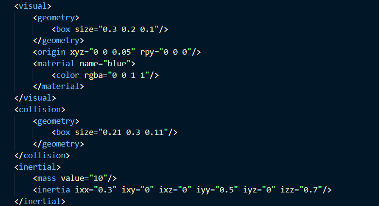
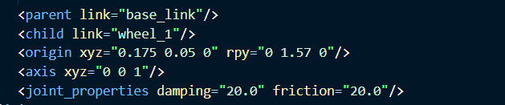

# 第二周任务报告
## 任务1
在该目录下的week2test下
效果如图：

## 任务2
文件在catkin_ws里
### 完成urdf绘制
总的来说就是写标签。
joint部分是按提示完成的。
link代码如下：

joint代码如下：

### 小车控制
publisher部分是从上一次的代码搬过来的
subcribler部分写在了main函数里
控制是
- 2 停止
- 4 6 转弯
- 8 加速

### 噪声转弯
还没写