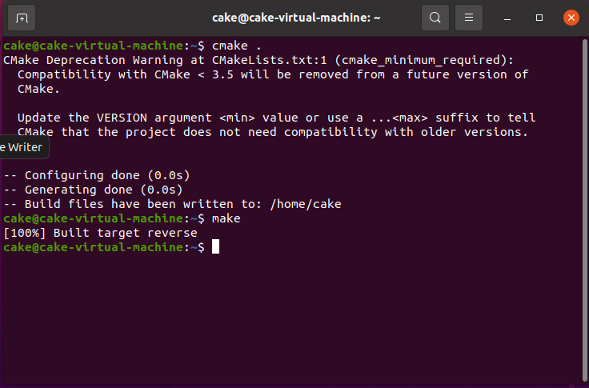
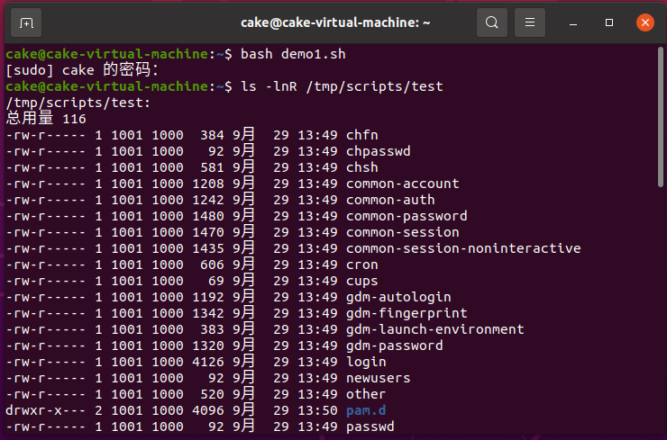
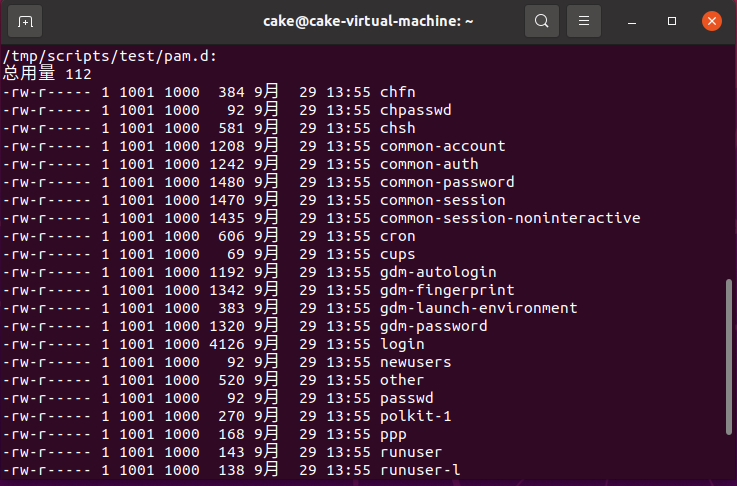
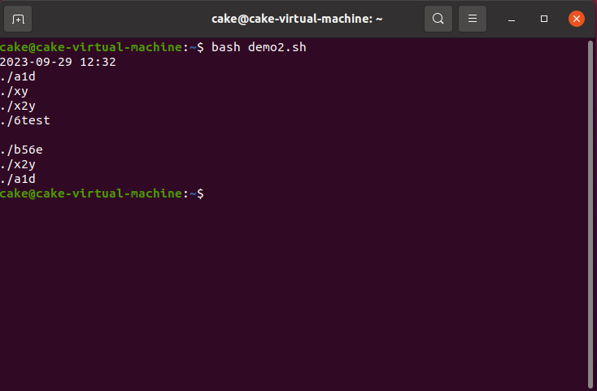
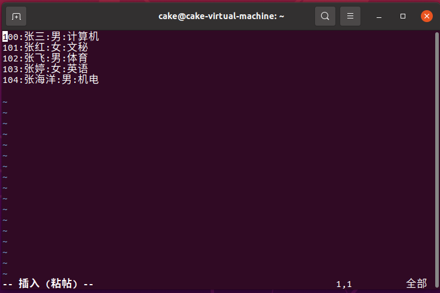
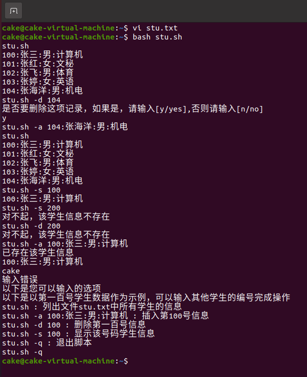
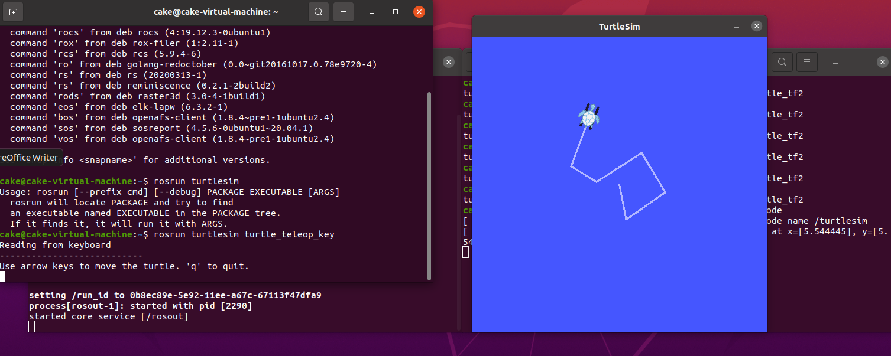
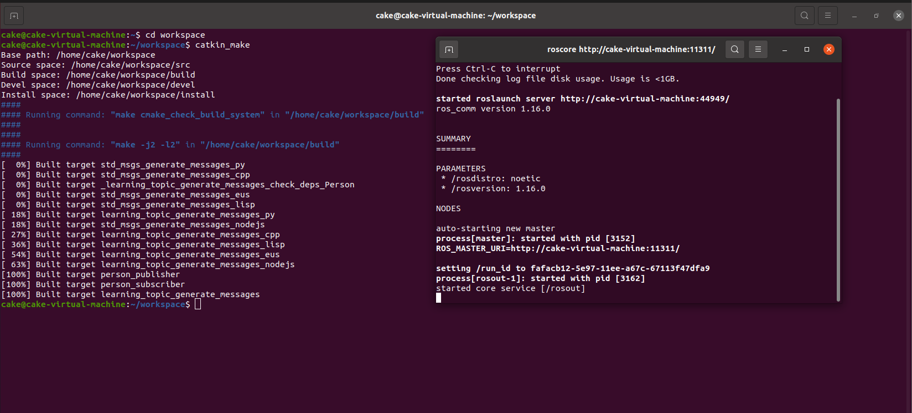
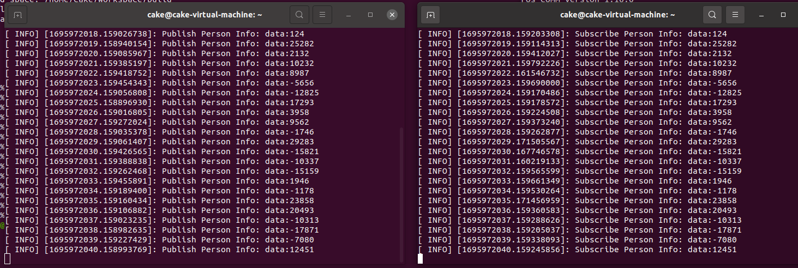

# 陈安康第一周考核报告(所有任务全部完成)

## 1 - vim和cmake的使用完成C++代码的编写与编译

### 1.1 学习情况汇报

​		在虚拟机上安装好Ubuntu，进一步安装vim和cmake。通过网上资料对这两个软件进行了学习。cmake与makefile的关系，通过学习总结如下：**makefile是一个文本文件，其中包含了批处理工具（如make）在执行对源文件的编译与链接时所要遵循的一系列规则和命令。而cmake是一个便于程序员生成makefile文件的强大工具。**通过cmake可以十分简单的生成makefile文件，从而减少程序员的工作量。

### 1.2 使用vim进行翻转列表代码的编写

​		首先通过Ubuntu上的vim对代码进行编写，调用命令vi reverselist.cpp创建reverselist.cpp文件通过i指令进入编辑模式，编辑完成后通过ESC退出至命令模式并通过:wq命令进行代码保存和文件退出。代码内容如下：

```c++
struct ListNode
{
	int val;
	ListNode *next;
	ListNode():val(0),next(nullptr){}
	ListNode(int x,ListNode *next):val(x),next(next){}
};
//采用三个指针完成列表反转
class Solution{
public:
	ListNode *reverseList(ListNode *head){
	if(head==nullptr||head->next==nullptr)
	return head;
	else
	{
		ListNode *cur = head->next;
		ListNode *last = cur->next;
		ListNode *pre = head;
		
		pre->next = nullptr;
		while(last!=nullptr)
		{ 
		cur->next = pre;
		pre = cur;
		cur = last;
		last = cur->next; 
		}
		cur->next = pre;
		head = cur;
		return head;
	}
        }
};
int main()
{
	return 0;

}//这个主函数没有用到
```

​		考虑到该段代码没有给出主函数，并且考核内容仅仅是要求编译文件，因此对于编写的代码正确性的验证，通过LeetCode上的题目进行。


### 1.3 使用cmake和makefile编译程序

​		首先进行了CMakeLists.txt 文件的编写，cmake要依据CMakeLists.txt 生成对应的makefile文件。在同级目录下采用vi CMakeLists.txt指令创建文件，并写入以下指令：

```cmake
cmake_minimum_required(VERSION 2.8)
project(demo)
add_executable(reverse reverselist.cpp)
```

​		创建完成后，当前目录执行 cmake . ，得到 Makefile 后再使用 make 命令编译得到 reverse可执行文件：




## 2 - Linux Shell 脚本编写

### 2.1 学习情况汇报

​		Shell 脚本（shell script），是一种为 shell编写的脚本程序。脚本就是由Shell命令组成的文件，这些命令都是可执行程序的名字，脚本不用编译即可运行。脚本文件可以用通过脚本解释器（bash)运行。脚本文件后缀为.sh。并通过学习掌握了基本的脚本编写知识，语法。

### 2.2 脚本编写实操

#### 2.2.1 第一个题目

​		通过vi demo1.sh指令创建并打开demo1.sh依照题目要求进行编写：

```bash
mkdir -p /tmp/scripts
cd /tmp/scripts
sudo cp -r /etc/pam.d ./test
#创建用户
if [ $? -ne 0 ]; then
    useradd "redhat"
fi
#修改属主
sudo chown -R redhat ./test
#修改其他用户权限为无任何权限
sudo chmod -R o-w,o-r,o-x ./test		
```

​		通过 bash demo1.sh命令进行运行：





#### 2.2.2 第二个题目

​		通过vi demo2.sh指令创建并打开demo2.sh依照题目要求进行编写：

```bash
#显示时间
echo "$(date +%F) $(date +%R)"
mkdir /tmp/lstest
cd /tmp/lstest
#创建文件和目录
mkdir a1d
mkdir b56e
mkdir 6test
touch {xy,x2y,732}
#按要求查找并显示
find . -name a\*
find . -name x\*
find . -name 6\*
echo " "
find . -name [a-zA-Z][0-9]\*
```

​		通过 bash demo2.sh命令进行运行：



#### 2.2.3 第三个题目

​		首先创建stu.txt文件,将内容复制到该文件中：



​		然后完成对stu.sh的编写：

```bash
student="/home/cake/stu.txt"
#死循环模式
while [ 1 ]; do
#接受指令
read stu
index=${stu:10:3} 
instruct=${stu:8:1}
#echo $instruct
#echo $index
#展示所有内容指令
if [ "${stu}" = "stu.sh" ]; then
	cat ${student}
#添加成员指令
elif [ "${instruct}" = "a" ]; then
	id=$(grep -n ${index} $student | cut -f1 -d :)
	if [ $id ]
	then
	echo "已存在该学生信息"
		grep ${index} $student
	else
		echo "${index}""${stu:13}" >> $student 
	fi
#删除成员指令
elif [ "${instruct}" = "d" ]; then
	id=$(grep -n ${index} $student | cut -f1 -d :)
	if [ $id ]
        then
		echo "是否要删除这项记录，如果是，请输入[y/yes],否则请输入[n/no]"
		read decision
		if [ "$decision" = "y" ] || [ "$decision" = "yes" ]; then
			 sed -i "${id}d" $student
		elif [ $decision = n ] || [ $decision = no ]; then
			:
		fi
        else
                echo "对不起，该学生信息不存在"
        fi
#显示特定成员指令
elif [ "${instruct}" = "s" ]; then
        id=$(grep -n ${index} $student | cut -f1 -d :)
        if [ $id ]
        then
                grep ${index} $student

        else
                echo "对不起，该学生信息不存在"
        fi
#退出指令
elif [ "${instruct}" = "q" ]; then
	break
else 
	echo "输入错误"
	echo "以下是您可以输入的选项"
	echo "以下是以第一百号学生数据作为示例，可以输入其他学生的编号完成操作"
	echo "stu.sh : 列出文件stu.txt中所有学生的信息"
	echo "stu.sh -a 100:张三:男:计算机 : 插入第100号信息"
	echo "stu.sh -d 100 : 删除第一百号信息"
	echo "stu.sh -s 100 : 显示该号码学生信息"
	echo "stu.sh -q : 退出脚本"

fi
done
```

​		虽然本题只要求实现对100:张三:男:计算机的功能。但为了功能的完备性和普遍性，我对此脚本进行改进，使其**允许对任意成员进行操作**，并且由于采用死循环模式，所以设置了**退出选项**。

​		运行此脚本，以下是部分运行情况：



​	

## 3 - ROS通信机制的学习

### 3.1 学习情况汇报

​		ROS是适用于机器人编程的框架，由核心通信机制、开发工具、应用功能和生态系统四个部分构成。ROS每一个进程（可执行程序）都以一个节点的形式运行，通过ROS Master进行节点管理，建立节点间的消息通信，组成了计算图。ROS通信机制主要有三种：话题、服务和参数共享。本次任务主要是针对话题。

​		话题通信机制，需要**“发布者”节点发布消息到指定的话题上，“订阅者”节点需要从同样的话题上接受“发布者”发布的消息**。该过程通过ROS Master这个“管家”进行管理，而链接一旦建立，则不需要“管家”的干预。该过程没有像服务通信机制那样的反馈机制。

​		**消息是节点之间传递的信息的数据格式**。ROS支持标准数据类型，同样也支持数据类型的嵌套以及自定义消息类型。

### 3.2 准备工作

#### 3.2.1 下载ROS

​		依据网上下载教程，结合Ubuntu版本，成功下载了Noetic LTS版本的ROS1。并且运行了海龟模拟器。



#### 3.2.2 创建工作空间和功能包

​		工作空间相当于visual studio上的项目，包括了build install src devel 四个部分。依据网上教程在Ubuntu上搭建了工作空间workspace。并从里面构建了功能包learning_topic，该功能包依赖roscpp等功能包。

### 3.3 自定义消息类型

​		依据网上的教程，结合实际题目要求，发现只需要传输一个整数数据即可，所以消息的定义十分简单。

​		在learning_topic功能包下创建msg文件夹用于存储消息类型从中创建Person.msg文件，并从中定义：

```
int16 data
```

​		定义完成并添加好各种配置后，回到工作空间根目录下运行编译指令catkin_make，编译完成后，会发现从devel/include/learning_topic文件夹中发现Person.h头文件。

### 3.4 编写“发布者”与“订阅者”节点

​		首先为了完成节点的编写，需要配置一些东西。具体流程全部按照网上教程进行了配置，比如说在CMakeLists.txt文件中配置：

```cmake
add_executable(person_publisher src/person_publisher.cpp)
target_link_libraries(person_publisher ${catkin_LIBRARIES})
add_dependencies(person_publisher ${PROJECT_NAME}_generate_messages_cpp)
   
add_executable(person_subscriber src/person_subscriber.cpp)
target_link_libraries(person_subscriber ${catkin_LIBRARIES})
add_dependencies(person_subscriber ${PROJECT_NAME}_generate_messages_cpp)
```

​		由于配置过程有些繁琐，并且更深层次的原因（为什么要进行这些配置，配置的包的功能）有些地方不是很清楚，还需要深入学习，这里不再进行赘述。

​		接下来进行节点的编写，同样是依据网上的教程代码进行了修改。

​		发布者代码：

```c++
#include "ros/ros.h"
#include "stdio.h"
#include "learning_topic/Person.h"

int main(int argc, char **argv)
{
    //初始化节点并创建句柄
	ros::init(argc, argv, "person_publisher");
	ros::NodeHandle node_handle;
   //创建Publisher
	ros::Publisher person_info_pub = node_handle.advertise<learning_topic::Person>("/person_info",10);
	ros::Rate rate(1);

	int number_count = 0;
	while(ros::ok())
	{
		learning_topic::Person person_msg;
        //初始化消息
		person_msg.data = rand();
         //发布消息到话题中
		person_info_pub.publish(person_msg);
		ROS_INFO("Publish Person Info: data:%d",person_msg.data);
	        rate.sleep();
		
	}

	return 0;
}	
```

​		订阅者代码：

```c++
#include <ros/ros.h>
#include "learning_topic/Person.h"
//回调函数，接受到消息之后就打印到终端
void num_callback(const learning_topic::Person::ConstPtr& msg)
{
ROS_INFO("Subscribe Person Info: data:%d",msg->data);
}

int main(int argc, char **argv)
{
    //初始化节点和创建句柄
	ros::init(argc, argv, "topic_subscriber");
	ros::NodeHandle node_handle;
	//创建Subscriber
	ros::Subscriber person_info_sub = node_handle.subscribe("/person_info", 10, num_callback);
	ros::spin();
	return 0;
}

```

### 3.5 运行功能包

1. 在工作空间目录配置环境变量。
2. 在工作目录catkin_make进行编译。		
3. 打开ROS Master。通过roscore命令。
4. 另开终端，运行两个节点

​		结果展示：






## 4 - 总结

​		这一周的学习使我基本了解了linux操作系统的运行机制，掌握了vim和cmake软件的使用方法，学会了基础的shell脚本的编写，接触了ROS元操作系统。从零开始接触这些东西感觉像是打开了另一个世界的大门。虽然一周内学到的量很多，但并不熟练，很多东西（尤其是ROS）基本上依赖网上教程去操作，希望接下来的深入学习可以使我对这些软件的运用更加得心应手。


