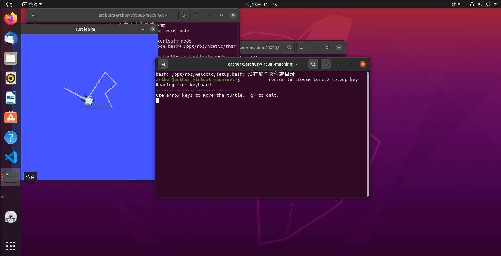

# 第一周作业
## 1. Reverse Linked List
代码 ```#include <iostream>//C++
using namespace std;
struct LNode
{
    int data;
    LNode * next;
};
void createList(LNode * &L,int n)
{
    /**< 尾插法创建单链表 */
    LNode *r, *p;
    r=L=new LNode;/**< 创建头结点 */
    L->next=NULL;
    for(int i=1; i<=n; i++)
    {
        p=new LNode;
        cin>>p->data;
        p->next=NULL;
        r->next=p;
        r=p;
    }
}
void trv(LNode * L)
{
    /**< 一个简单的链表遍历函数，供编程过程中测试使用 */
    L=L->next;
    while(L)
    {
        cout<<L->data<<' ';
        L=L->next;
    }
}
void reverseList(LNode * &L)
{
    LNode *pre = NULL;/**< 用三个指针分别表示前驱，当前，后继 */
    LNode *cur = L->next;/**< 当前是第一个节点a1 */
    LNode *nex = NULL; /**<思考如何用这三个指针实现翻转，另外，三个指针也要同步后移 */
    while (cur)
    {
       nex=cur->next;
       cur->next=pre;
       pre=cur;
       cur=nex;
    }
    L->next=pre;
}
int main()
{
    int n;
    LNode *L;
    cin>>n;
    createList(L,n);
    reverseList(L);
    trv(L);
    return 0;
}
/*
输入样例
5
1 2 3 4 5


输出样例
5 4 3 2 1*/```

不太会在linux下使用cmake进行编译


## 2. Linux Shell
**2.1 写一个脚本**


脚本书写运用了变量，简便的代替了路径/tmp/scripts
使用了if语句判断目录是否存在
使用了cd cp chown chmod等指令完成任务


**2.2 写一个脚本**
使用shell脚本


使用了变量，与多个if语句
使用date命令实现输出日期
使用不同的find命令完对文件的搜索

**2.3 题目要求：** 
由于时间有限未能来的及完成此任务


## 3. ROS通信机制





跟随教程完成ros的安装，同时测试小海龟成功！

> 首先创建一个工作空间，在终端使用命令
>> mkdir -p/ZuoYe/src
>> cd~/ZuoYe/src
>> . catkin_init_workspace
> 编译工作空间，   在终端使用命令
>> cd~/ZuoYe/
>> catkin_make
>> catkin_make install
> 设置环境变量 
>> source devel/setup.bash
> 创建功能包       
>> 在文件夹中创建src目录                     
>>使用命令catkin_create_pkg   文件名  后面加一些依赖如rpscpp等
>> 在src中放入代码文件（看了古月居的视频，代码还是不太会写使用了他的代码）
>> 设置链接库
>> 使用caktin_make 命令进行编译
>> 后进行测试 
订阅者与发布者的代码放入src文件夹里


编译成功


发布者代码    
订阅者代码  


代码均来自古月居自己还没有能力可以敲写       


