# 陈安康飞控组第二周任务提交（任务全部完成）

## 1- 完成Service与Client通信

### 1.1 知识点学习

​		服务通信是ROS重要的通信机制，相比于话题，服务多了反馈响应，更加便于节点交流。服务主要包括Client、service、server三部分。在学习过服务的基本知识后，开始完成任务。

### 1.2 Client的实现

​		Client是信息的发送者。经过学习加上对网上代码的借鉴修改，Client代码如下：

```c++
#include <ctime>
#include <random>
#include <ros/ros.h>
#include "learning_service/Person.h"
using namespace std;

int main(int argc, char** argv)
{
    // 初始化ROS节点
	ros::init(argc, argv, "person_client");

    // 创建节点句柄
	ros::NodeHandle node;

    // 发现/spawn服务后，创建一个服务客户端，连接名为/spawn的service
	ros::service::waitForService("/show_person");
	ros::ServiceClient person_client = node.serviceClient<learning_service::Person>("/show_person");

    // 初始化learning_service::Person的请求数据
     ros::Rate loop_rate(10);
        while(ros::ok()){
	learning_service::Person srv;
    //实现0-1随机浮点数
	uniform_real_distribution<double> u(0,1);
	default_random_engine e(time(NULL));
	srv.request.request = u(e);

    // 请求服务调用

	person_client.call(srv);
	ROS_INFO("%f",srv.request.request);
	// 显示服务调用结果
	if(srv.response.response)
	ROS_INFO("Yes");
	else
	ROS_INFO("No");		
	loop_rate.sleep();
}
	return 0;
};
```

​		此代码主体借鉴网上代码，所以service的名称没有自定义成合适的名字（不过影响不大）。但信息类型（srv文件）是自己定义的：

```
float64 request
---
bool response
```

​		其中“---”是响应和回复的分界线，同时编译时也会生成不同头文件，为了方便，这里Client包含的是最全的那个头文件。

### 1.2 Server的实现

​		Server实现如下：

```c++
#include <ros/ros.h>
#include "learning_service/Person.h"

// service回调函数，输入参数req，输出参数res
bool personCallback(learning_service::Person::Request  &req,
         			learning_service::Person::Response &res)
{
   
        
	// 设置反馈数据
	if(req.request<0.5)
	res.response = 1;
	else
	res.response = 0;

    return true;
}

int main(int argc, char **argv)
{
    // ROS节点初始化
    ros::init(argc, argv, "person_server");

    // 创建节点句柄
    ros::NodeHandle n;

    // 创建一个名为/show_person的server，注册回调函数personCallback
    ros::ServiceServer person_service = n.advertiseService("/show_person", personCallback);

    // 循环等待回调函数
    ROS_INFO("Ready to show person informtion.");
    ros::spin();

    return 0;
}
```

​		通过回调函数设置反馈数据，控制Client打印。

### 1.3 成果展示

​		经过配置，实现效果如下:

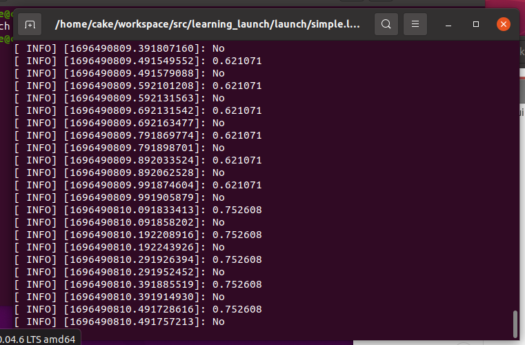

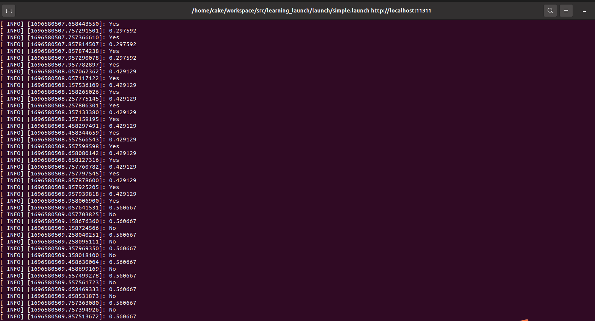

​		由于设置问题，这个随机小数会连续出现几次再变化，由于时间紧张就没有对这个问题进行更改，长时间来看产生的随机小数是随机的。

## 2- 编写launch文件来启动节点

### 2.1 知识点学习

​		launch文件是采用**XML**格式书写的文件。通过rosrun指令一个个节点启动工程量很大，可以通过launch文件一次性启动多个节点，并且launch文件启动节点不需要手动打开ROS Master（roscore指令）。除此之外，launch文件还可以对参数进行操作等，运行launch文件可以用roslaunch命令来运行。

### 2.2 通过launch文件启动任务1的两个节点

​		通过对XML的学习，编写launch代码如下(中间建立了一个launch的功能包，不过多赘述)：

```xml
<launch>
    <node pkg="learning_service" type="person_client" name="client" output="screen" />
    <node pkg="learning_service" type="person_server" name="server" output="screen" /> 
</launch>
```

### 2.3 成果展示

​		通过launch文件成功启动两个节点：

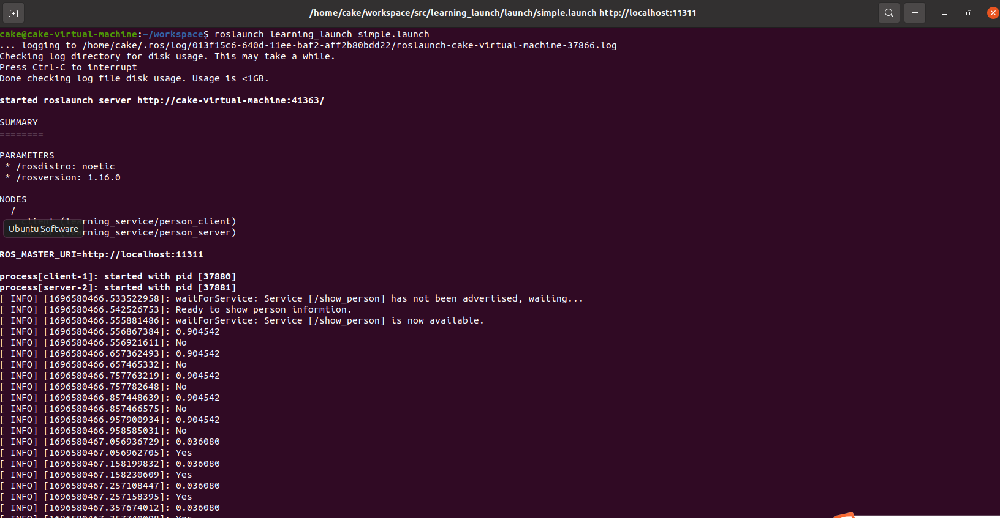


## 3- 搭建小车的urdf模型

### 3.1 知识点学习

​		URDF全称（United Robotics Description Format）统一机器人描述格式，是一个XML语法框架下用来描述机器人的语言格式。可以通过URDF文件实现仿真模拟和分析，减少不必要的开支。

### 3.2 补全小车的urdf模型

​		学习过link和joint的基本知识后，补全如下：

```xml
<?xml version="1.0" ?>
<robot name = "little_car">
	<link name="base_link">
	<!-- 在此处搭一个小车模型，
			重心离地0.05,
			视图为一个0.3×0.2×0.1的蓝色长方体，
			碰撞箱为0.21×0.3×0.11
			质量为10 -->
		 <visual>                                             
            	 	<origin xyz="0 0 0" rpy="0 0 0" />            
            		<geometry>                                  
                		 <box size="0.3 0.2 0.1" />  
            		</geometry>
            		<material name="blue">                         
                		<color rgba="0 0 1 1"/>                
           		 </material>
                </visual>
		 <collision>
      		<geometry>
       		 <box size="0.21 0.3 0.11" /> 
      		</geometry>
    		</collision> 
		<origin xyz="0 0 0.5" rpy="0 0 0" />
    		<mass value="10"/>  
	</link>

	<!-- front wheel -->
	<link name="wheel_1">
		<!-- 在此处搭一个轮子，
			视图为一个0.05长，0.05半径的圆柱体，
			碰撞箱同上
			质量为10 -->
 		<visual>                                             
            	 	<origin xyz="0 0 0" rpy="0 0 0" />             
            		<geometry>                                       
                		 <cylinder radius="0.05" length="0.05"/>  
            		</geometry>
            		<material name="black">                         
                		<color rgba="1 1 1 1"/>                    
           		 </material>
                </visual>
		 <collision>
      		<geometry>
       		 <box size="0.21 0.3 0.11" /> 
      		</geometry>
    		</collision>
                <mass value="10"/> 
	</link>

	<link name="wheel_2">
		<!--   同上一个轮子  -->
		<visual>                                              
            	 	<origin xyz="0 0 0" rpy="0 0 0" />              
            		<geometry>                                       
                		 <cylinder radius="0.05" length="0.05"/>  
            		</geometry>
            		<material name="black">                         
                		<color rgba="1 1 1 1"/>                
           		 </material>
                </visual>
		 <collision>
      		<geometry>
       		 <box size="0.21 0.3 0.11" /> 
      		</geometry>
    		</collision>
                <mass value="10"/> 
	</link>


	<link name="wheel_3">
		<!--   同上一个轮子  -->
		<visual>                                         
            	 	<origin xyz="0 0 0" rpy="0 0 0" />             
            		<geometry>                                        
                		 <cylinder radius="0.05" length="0.05"/>  
            		</geometry>
            		<material name="black">                         
                		<color rgba="1 1 1 1"/>                
           		 </material>
                </visual>
		 <collision>
      		<geometry>
       		 <box size="0.21 0.3 0.11" /> 
      		</geometry>
    		</collision>
                <mass value="10"/> 
	</link>


	<link name="wheel_4">
		<!--   同上一个轮子  -->
		<visual>                                            
            	 	<origin xyz="0 0 0" rpy="0 0 0" />              
            		<geometry>                                        
                		 <cylinder radius="0.05" length="0.05"/>  
            		</geometry>
            		<material name="black">                         
                		<color rgba="1 1 1 1"/>                 
           		 </material>
                </visual>
		 <collision>
      		<geometry>
       		 <box size="0.21 0.3 0.11" /> 
      		</geometry>
    		</collision>
                <mass value="10"/> 
	</link>

	<joint name="base_to_wheel_1" type="continuous">
		<!--在此处填入四个性质，下面三个轮子同理，注意分别链接在不同位置
		<parent>
		<child>
		<axis >
		<origin/>
		tips:转轴定为z轴（初始圆柱体正立放置）
			origin的xyz偏移按照上面的箱子计算得出，rpy绕y轴转90度（urdf中为弧度制）
			-->
	        <parent link="base_link"/>
		<child link="wheel_1"/>
		<axis  xyz="0.0 0.0 1.0"/>
		<origin xyz="0.1 0.1 0.0" rpy="1.57 1.57 0"/>
		<joint_properties damping="20.0" friction="20.0"/>
	</joint>

	<joint name="base_to_wheel_2" type="continuous">
		<parent link="base_link"/>
		<child link="wheel_2"/>
		<axis  xyz="0.0 0.0 1.0"/>
		<origin xyz="-0.1 0.1 0.0" rpy="1.57 1.57 0"/>
		<joint_properties damping="20.0" friction="20.0"/>
	</joint>


	<joint name="base_to_wheel_3" type="continuous">
            	<parent link="base_link"/>
		<child link="wheel_3"/>
		<axis  xyz="0.0 0.0 1.0"/>
		<origin xyz="0.1 -0.1 0.0" rpy="1.57 1.57 0"/>
		<joint_properties damping="20.0" friction="20.0"/>
	</joint>


	<joint name="base_to_wheel_4" type="continuous">
	        <parent link="base_link"/>
		<child link="wheel_4"/>
		<axis  xyz="0.0 0.0 1.0"/>
		<origin xyz="-0.1 -0.1 0.0" rpy="1.57 1.57 0"/>
		<joint_properties damping="20.0" friction="20.0"/>
	</joint>
</robot>
```

​		正对X轴方向。其效果图：

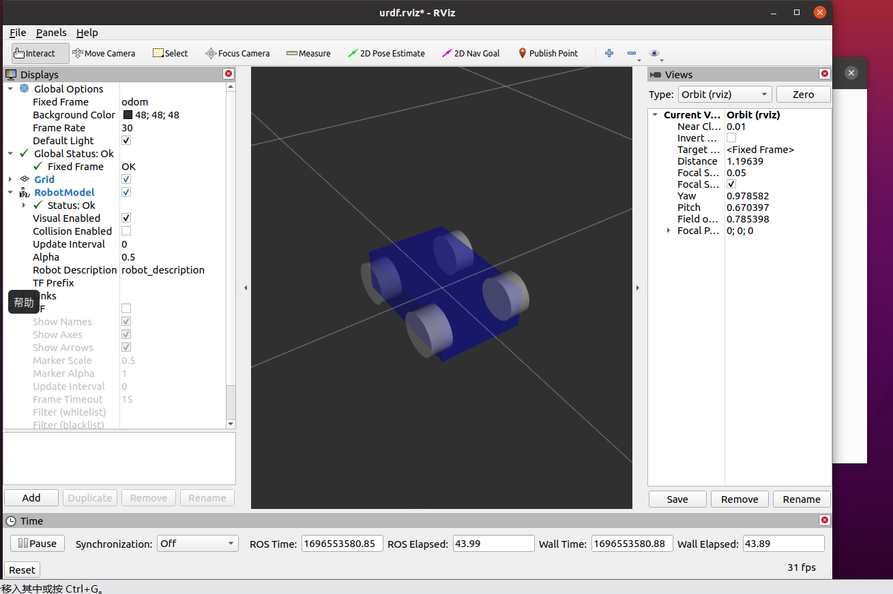

​		PS：此图片是在设置速度为零时的截图。其实可以不让它穿模，但我感觉那样不美观（太丑了）所以没有更改。

​		在此过程中，发现源代码中有一处在我的电脑上出错的问题，是在launch文件夹中的little_car.launch里面，publisher的type类型报错，以下是进行修改后的代码：

```xml
<node name="robot_state_publisher" pkg="robot_state_publisher" type="robot_state_publisher" />
```

​		这个问题好像是版本原因。

## 4- 使用solidworks导出模型（选做）

​		因为我有一些solidworks基础，所以选做了此任务。

### 4.1 画出小车模型

​		刚开始想着赶时间，所以开始画小车并没有按照小车的尺寸严格进行，想着先做出来再说，到后面想改时又不愿意了，所以这个小车模型是尺寸是随意的。

​		从零组件中画出车身，轮子后新建装配体进行组装和配合：

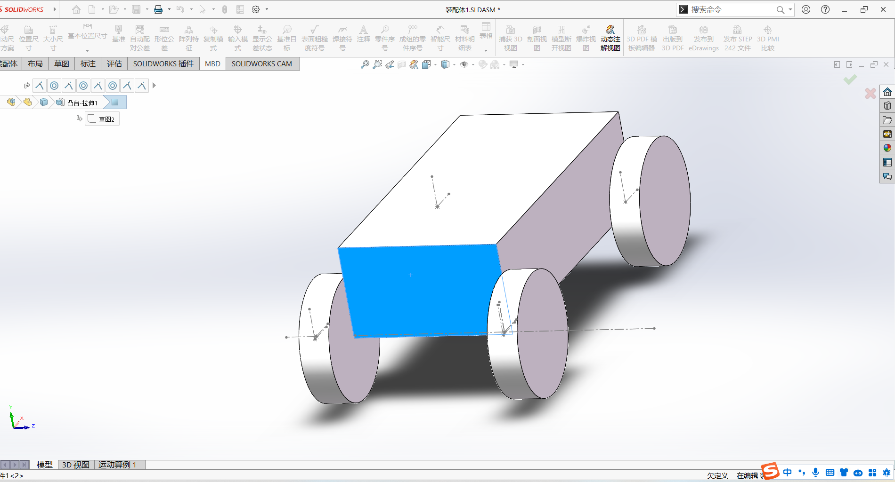

### 4.2 下载插件完成导出

​		网上下载sw2urdf插件，并且类比网上教程生成了小车的urdf插件：

```xml
<?xml version="1.0" encoding="utf-8"?>
<!-- This URDF was automatically created by SolidWorks to URDF Exporter! Originally created by Stephen Brawner (brawner@gmail.com) 
     Commit Version: 1.6.0-4-g7f85cfe  Build Version: 1.6.7995.38578
     For more information, please see http://wiki.ros.org/sw_urdf_exporter -->
<robot
  name="装配体1.SLDASM">
  <link
    name="base_link">
    <inertial>
      <origin
        xyz="0.0517803475487482 0.0145762377834093 0.0364442833495505"
        rpy="0 0 0" />
      <mass
        value="0.168433577741048" />
      <inertia
        ixx="5.1894392144424E-05"
        ixy="-2.30669263615489E-21"
        ixz="1.48048205054515E-20"
        iyy="0.00019743717510779"
        iyz="4.45258112332264E-37"
        izz="0.000170807819624523" />
    </inertial>
    <visual>
      <origin
        xyz="0 0 0"
        rpy="0 0 0" />
      <geometry>
        <mesh
          filename="package://装配体1.SLDASM/meshes/base_link.STL" />
      </geometry>
      <material
        name="">
        <color
          rgba="1 1 1 1" />
      </material>
    </visual>
    <collision>
      <origin
        xyz="0 0 0"
        rpy="0 0 0" />
      <geometry>
        <mesh
          filename="package://装配体1.SLDASM/meshes/base_link.STL" />
      </geometry>
    </collision>
  </link>
  <link
    name="wheel1">
    <inertial>
      <origin
        xyz="-1.0842E-18 -5.421E-20 0.005"
        rpy="0 0 0" />
      <mass
        value="0.012566" />
      <inertia
        ixx="1.3614E-06"
        ixy="7.0096E-54"
        ixz="-1.7647E-23"
        iyy="1.3614E-06"
        iyz="-2.4284E-39"
        izz="2.5133E-06" />
    </inertial>
    <visual>
      <origin
        xyz="0 0 0"
        rpy="0 0 0" />
      <geometry>
        <mesh
          filename="package://装配体1.SLDASM/meshes/wheel1.STL" />
      </geometry>
      <material
        name="">
        <color
          rgba="1 1 1 1" />
      </material>
    </visual>
    <collision>
      <origin
        xyz="0 0 0"
        rpy="0 0 0" />
      <geometry>
        <mesh
          filename="package://装配体1.SLDASM/meshes/wheel1.STL" />
      </geometry>
    </collision>
  </link>
  <joint
    name="joint1"
    type="continuous">
    <origin
      xyz="-0.0012978 -0.062889 -0.00042376"
      rpy="1.5708 0 0" />
    <parent
      link="base_link" />
    <child
      link="wheel1" />
    <axis
      xyz="0 0 1" />
  </joint>
  <link
    name="wheel2">
    <inertial>
      <origin
        xyz="-1.0842E-18 -1.0842E-19 0.005"
        rpy="0 0 0" />
      <mass
        value="0.012566" />
      <inertia
        ixx="1.3614E-06"
        ixy="0"
        ixz="2.2959E-39"
        iyy="1.3614E-06"
        iyz="-2.4284E-39"
        izz="2.5133E-06" />
    </inertial>
    <visual>
      <origin
        xyz="0 0 0"
        rpy="0 0 0" />
      <geometry>
        <mesh
          filename="package://装配体1.SLDASM/meshes/wheel2.STL" />
      </geometry>
      <material
        name="">
        <color
          rgba="1 1 1 1" />
      </material>
    </visual>
    <collision>
      <origin
        xyz="0 0 0"
        rpy="0 0 0" />
      <geometry>
        <mesh
          filename="package://装配体1.SLDASM/meshes/wheel2.STL" />
      </geometry>
    </collision>
  </link>
  <joint
    name="joint2"
    type="continuous">
    <origin
      xyz="-0.0012978 0 -0.00042376"
      rpy="1.5708 0 0" />
    <parent
      link="base_link" />
    <child
      link="wheel2" />
    <axis
      xyz="0 0 1" />
  </joint>
  <link
    name="wheel3">
    <inertial>
      <origin
        xyz="0 0 0.005"
        rpy="0 0 0" />
      <mass
        value="0.012566" />
      <inertia
        ixx="1.3614E-06"
        ixy="7.0096E-54"
        ixz="-1.7647E-23"
        iyy="1.3614E-06"
        iyz="-2.4284E-39"
        izz="2.5133E-06" />
    </inertial>
    <visual>
      <origin
        xyz="0 0 0"
        rpy="0 0 0" />
      <geometry>
        <mesh
          filename="package://装配体1.SLDASM/meshes/wheel3.STL" />
      </geometry>
      <material
        name="">
        <color
          rgba="1 1 1 1" />
      </material>
    </visual>
    <collision>
      <origin
        xyz="0 0 0"
        rpy="0 0 0" />
      <geometry>
        <mesh
          filename="package://装配体1.SLDASM/meshes/wheel3.STL" />
      </geometry>
    </collision>
  </link>
  <joint
    name="joint3"
    type="continuous">
    <origin
      xyz="0.10486 -0.062889 -0.00042376"
      rpy="1.5708 0 0" />
    <parent
      link="base_link" />
    <child
      link="wheel3" />
    <axis
      xyz="0 0 1" />
  </joint>
  <link
    name="wheel4">
    <inertial>
      <origin
        xyz="-1.3878E-17 -5.421E-20 0.005"
        rpy="0 0 0" />
      <mass
        value="0.012566" />
      <inertia
        ixx="1.3614E-06"
        ixy="0"
        ixz="2.2959E-39"
        iyy="1.3614E-06"
        iyz="-2.4284E-39"
        izz="2.5133E-06" />
    </inertial>
    <visual>
      <origin
        xyz="0 0 0"
        rpy="0 0 0" />
      <geometry>
        <mesh
          filename="package://装配体1.SLDASM/meshes/wheel4.STL" />
      </geometry>
      <material
        name="">
        <color
          rgba="1 1 1 1" />
      </material>
    </visual>
    <collision>
      <origin
        xyz="0 0 0"
        rpy="0 0 0" />
      <geometry>
        <mesh
          filename="package://装配体1.SLDASM/meshes/wheel4.STL" />
      </geometry>
    </collision>
  </link>
  <joint
    name="joint4"
    type="continuous">
    <origin
      xyz="0.10486 0 -0.00042376"
      rpy="1.5708 0 0" />
    <parent
      link="base_link" />
    <child
      link="wheel4" />
    <axis
      xyz="0 0 1" />
  </joint>
</robot>
```

过程中的截图：

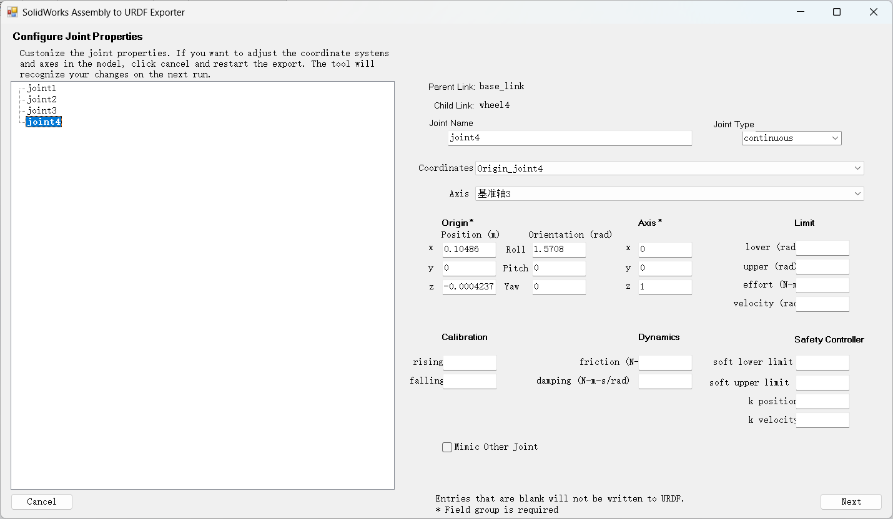		

​		其实应该先做这个任务按照小车尺寸画好后生成urdf文件，这样也就不用写前面的小车文件了，做完这个任务后有点小后悔。


## 5- 实现通过Publisher控制小车运动

### 5.1 直接在代码中实现小车转弯

​		设计为保持匀速的圆周运动（应该算转弯吧）：

```c++
#include "parser.h"
#include <urdf/model.h>
#include <string>
#include <sensor_msgs/JointState.h>
#include <tf/transform_broadcaster.h>
#include <geometry_msgs/Point.h>
#include <ros/ros.h>
#include <random>
#include <iomanip>
#include <math.h>
using namespace std;

int main(int argc, char** argv) {
    //定义lenv记录速度大小
	double lenv;
    ros::init(argc, argv, "state_publisher");
    ros::NodeHandle n;
	little_car car;//初始化控制对象  小车
    car.joint_pub = n.advertise<sensor_msgs::JointState>("joint_states", 1);
	car.pos_pub = n.advertise<geometry_msgs::Point>("car_position",1); //小车的位置消息发布
	/* 
	 *请添加一个Subscriber，从你自己编写的Publisher处订阅指令
	 */
	/*
	 *若有需要，也可以从小车处发布你所需要的信息
	 */
    ros::Rate loop_rate(60);
	SVector3 velocity={0.004,0,0};  //速度向量
	car.set_noise_level(0);		   //设置噪声等级
	float yaw = 0.0;
    while (ros::ok()) {
		yaw += 0.001;
		car.set_yaw(yaw); 		//修改小车的方向
		lenv=sqrt(pow(velocity.x,2)+pow(velocity.y,2)+pow(velocity.z,2));
            	velocity.x=lenv*cos(yaw);
		velocity.y=lenv*sin(yaw);
		car.set_velocity(velocity);//设置小车速度
                car.update_();//小车状态更新
		loop_rate.sleep();
    }


    return 0;
}
```

运动过程如下：

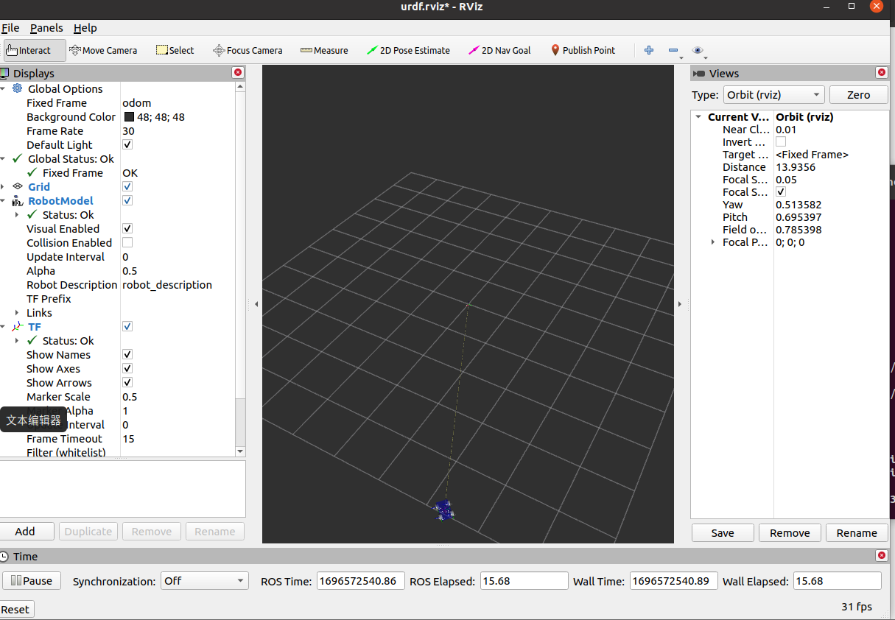

### 5.2 通过publisher控制小车运动

​		这里还是选择让小车走圆形，主要是针对速度向量的更改，创建publisher功能包，其中publisher的代码如下：

```c++
//#include "little_car"
#include <urdf/model.h>
#include <string>
#include <sensor_msgs/JointState.h>
#include <tf/transform_broadcaster.h>
#include <geometry_msgs/Point.h>
#include <ros/ros.h>
int main(int argc, char **argv)
{
	ros::init(argc, argv, "controler");
	ros::NodeHandle node_handle;

	ros::Publisher control_pub=node_handle.advertise<geometry_msgs::Point>("/control",10);
	ros::Rate rate(20);

	int number_count = 0;
	while(ros::ok())
	{
		geometry_msgs::Point velocity;
		velocity.x=0.008;
		velocity.y=0;
		velocity.z=0.05;//这个是偏航角的变化量
		control_pub.publish(velocity);
		ROS_INFO("Publish");
	        rate.sleep();
		
	}

	return 0;
}
```

​		话题为自定义话题“/control”，消息类型为"geometry_msgs::Point"，主要是通过消息去给小车传递速度偏航角变化量和速度大小，其中用z代表偏航量。频率为20Hz。头文件是为了防止有错误直接复制来的，会有不必要的头文件。

​		在main.cpp中编写如下：

```C++
#include "parser.h"
#include <urdf/model.h>
#include <string>
#include <sensor_msgs/JointState.h>
#include <tf/transform_broadcaster.h>
#include <geometry_msgs/Point.h>
#include <ros/ros.h>
#include <random>
#include <iomanip>
using namespace std;
SVector3 velocity={0,0,0};  //速度向量
float yaw = 0.0;
void num_callback(const geometry_msgs::Point::ConstPtr& msg)
{
	yaw+=msg->z;	
        double lenv=sqrt(pow(msg->x,2)+pow(msg->x,2));
        velocity.x=lenv*cos(yaw);
	velocity.y=lenv*sin(yaw);
}
int main(int argc, char** argv) {
    ros::init(argc, argv, "state_publisher");
    ros::NodeHandle n;
	little_car car;//初始化控制对象  小车
    car.joint_pub = n.advertise<sensor_msgs::JointState>("joint_states", 1);
	car.pos_pub = n.advertise<geometry_msgs::Point>("car_position",1); //小车的位置消息发布
	/* 
	 *请添加一个Subscriber，从你自己编写的Publisher处订阅指令
	 */
	ros::Subscriber state_subscriber_sub = n.subscribe("/control", 10, num_callback);
	/*
	 *若有需要，也可以从小车处发布你所需要的信息
	 */
    ros::Rate loop_rate(60);
	car.set_noise_level(0);		   //设置噪声等级
    while (ros::ok()) {
	//	yaw += 0.01;
		car.set_yaw(yaw); 		   //修改小车的方向
		car.set_velocity(velocity);//设置小车速度
                car.update_();//小车状态更新
                ros::MultiThreadedSpinner spinner(3);//多线程
                ros::spinOnce();
		loop_rate.sleep();
    }


    return 0;
}
```

​		采用三线程，把velocity和yaw修改为了全局变量，所以回调函数可以对它们进行修改，不过我有点感觉这不是此题想要我达到的效果。

​		实现效果如下：

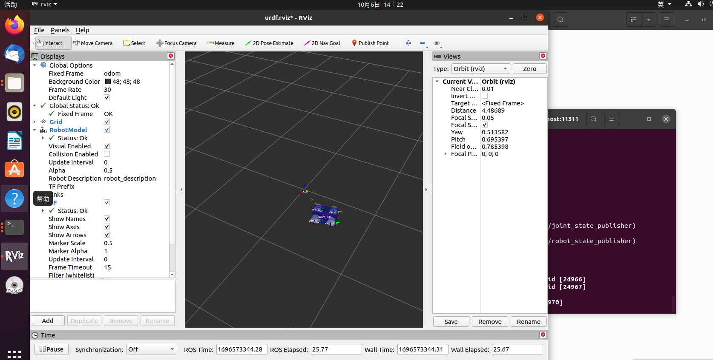

​		

## 6- 让小车走S形（1级噪声）

### 6.1 小车走s弯：

​		对上述publisher中的main.cpp进行改进，小车成功走S弯：

```c++
#include "parser.h"
#include <urdf/model.h>
#include <string>
#include <sensor_msgs/JointState.h>
#include <tf/transform_broadcaster.h>
#include <geometry_msgs/Point.h>
#include <ros/ros.h>
#include <random>
#include <iomanip>
using namespace std;
SVector3 velocity={0,0,0};  //速度向量
float yaw = 0.0;
int sign=1;
void num_callback(const geometry_msgs::Point::ConstPtr& msg)
{
	yaw+=sign*msg->z;	
        double lenv=sqrt(pow(msg->x,2)+pow(msg->y,2));
        velocity.x=lenv*cos(yaw);
	velocity.y=lenv*sin(yaw);
}
int main(int argc, char** argv) {
    ros::init(argc, argv, "state_publisher");
    ros::NodeHandle n;
	little_car car;//初始化控制对象  小车
    car.joint_pub = n.advertise<sensor_msgs::JointState>("joint_states", 1);
	car.pos_pub = n.advertise<geometry_msgs::Point>("car_position",1); //小车的位置消息发布
	/* 
	 *请添加一个Subscriber，从你自己编写的Publisher处订阅指令
	 */
	ros::Subscriber state_subscriber_sub = n.subscribe("/control", 10, num_callback);
	/*
	 *若有需要，也可以从小车处发布你所需要的信息
	 */
    ros::Rate loop_rate(60);
	car.set_noise_level(0);		   //设置噪声等级
    while (ros::ok()) {
	//	yaw += 0.01;
		if(car.get_position().x<0)
		sign=-1;
		else
		sign=1;
		car.set_yaw(yaw); 		   //修改小车的方向
		car.set_velocity(velocity);//设置小车速度
                car.update_();//小车状态更新
                ros::MultiThreadedSpinner spinner(5);
                ros::spinOnce;
		loop_rate.sleep();
    }


    return 0;
}
```

​		设置了sign信号控制控制转向。

​		实现效果：

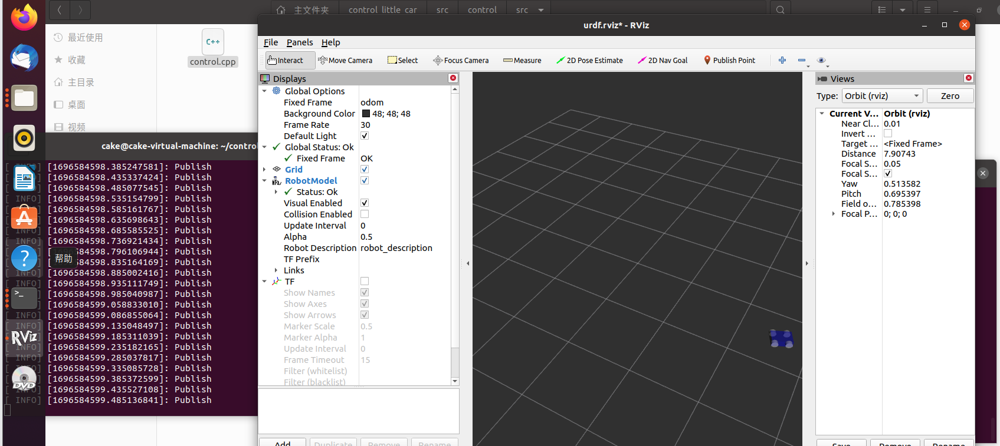

### 6.3 通过PID控制实现小车在一级噪声下行走S弯

​		PID通过误差、误差积分、误差微分综合对实际值进行修正，使之接近目标值。其公式为：


​		计划在parser.h的little_car类中添加以下成员和函数：

```c++
private:
		double errory;
		double error_sumy;
		double error_last_y;
	    double errorx;
		double error_sumx;
		double error_last_x;
        float kp_=0.725;          // 比例系数
    	float ki_=0.225;          // 积分系数
    	float kd_=0.05;          // 微分系数
public:
		SVector3 pidy(float target); //修正y方向的速度
		SVector3 pidx(float target); //修正x方向的速度
```

​		在parser.cpp中添加定义：

```c++
SVector3 little_car::pidy(float target)
{
	 // 计算误差及其变化率
    errory = target - get_velocity().y; // 计算误差
    double derror_y = error_last_y - errory; // 计算误差变化率
    error_last_y = errory;


    // 计算控制输出值
    error_sumy += errory;
    float deltay = kp_ * errory + ki_ * error_sumy + kd_ * derror_y;
    float y=get_velocity().y+deltay;
    SVector3 vel={get_velocity().x,y,0};
    set_velocity(vel);
    //if(fabs(y-target)>0.001)
    // pid()
    return this->_velocity;
}
SVector3 little_car::pidx(float target)
{
	 // 计算误差及其变化率
    errorx = target - get_velocity().x; // 计算误差
    double derror_x = error_last_x - errorx; // 计算误差变化率
    error_last_x = errorx;


    // 计算控制输出值
    error_sumx += errorx;
    float deltax = kp_ * errorx + ki_ * error_sumx + kd_ * derror_x;
    float x=get_velocity().x+deltax;
    SVector3 vel={x,get_velocity().y,0};
    set_velocity(vel);
    //if(fabs(y-target)>0.001)
    // pid()
    return this->_velocity;
}

```

​		对main.cpp的修改，我采用的是直接改代码类型的：

```c++
#include "parser.h"
#include <urdf/model.h>
#include <string>
#include <sensor_msgs/JointState.h>
#include <tf/transform_broadcaster.h>
#include <geometry_msgs/Point.h>
#include <ros/ros.h>
#include <random>
#include <iomanip>
#include <math.h>
using namespace std;

int main(int argc, char** argv) {
	double lenv;
int sign=1;
    ros::init(argc, argv, "state_publisher");
    ros::NodeHandle n;
	little_car car;//初始化控制对象  小车
    car.joint_pub = n.advertise<sensor_msgs::JointState>("joint_states", 1);
	car.pos_pub = n.advertise<geometry_msgs::Point>("car_position",1); //小车的位置消息发布
	/* 
	 *请添加一个Subscriber，从你自己编写的Publisher处订阅指令
	 */
	/*
	 *若有需要，也可以从小车处发布你所需要的信息
	 */
    ros::Rate loop_rate(60);
	SVector3 velocity={0.004,0,0};  //速度向量
	car.set_noise_level(1);		   //设置噪声等级
	float yaw = 0.0;
    while (ros::ok()) {
               if(car.get_position().x<0)
		sign=-1;
		else
		sign=1;
		yaw += sign*0.01;
		car.set_yaw(yaw); 		//修改小车的方向
		lenv=sqrt(pow(velocity.x,2)+pow(velocity.y,2)+pow(velocity.z,2));
            	velocity.x=lenv*cos(yaw);
		velocity.y=lenv*sin(yaw);
		car.set_velocity(car.pidy(lenv*sin(yaw)));
		car.set_velocity(car.pidx(lenv*cos(yaw)));//通过pid修正后设置小车速度
                car.update_();//小车状态更新
		loop_rate.sleep();
    }


    return 0;
    }
```

​		在一级噪声下，没有经过pid控制的小车S弯完全失衡：

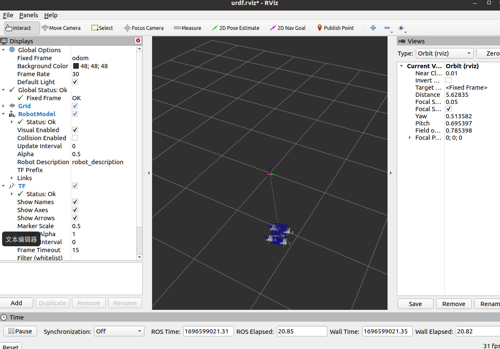

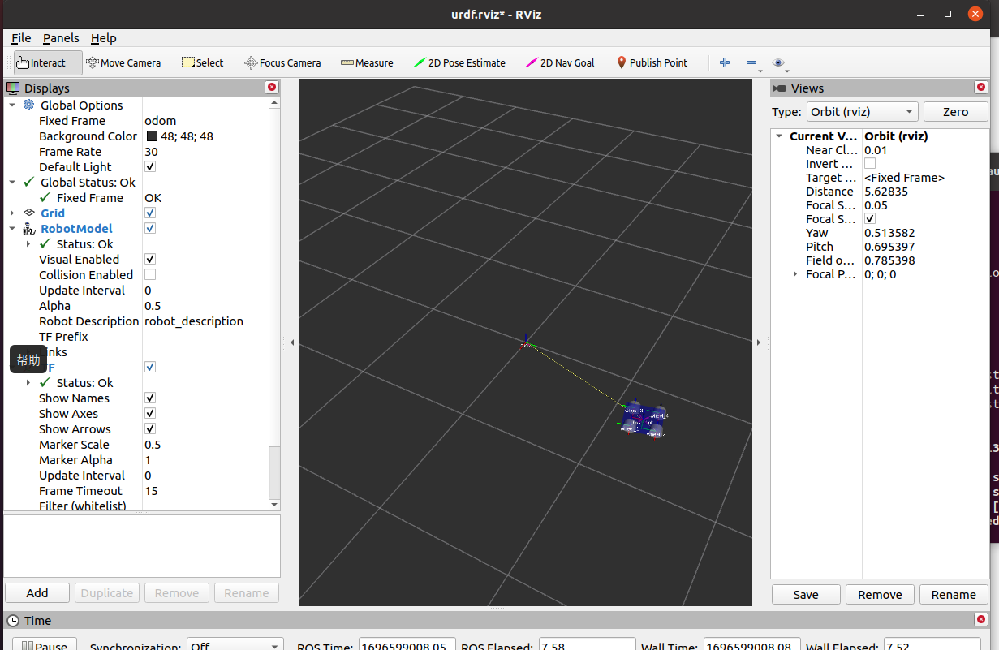

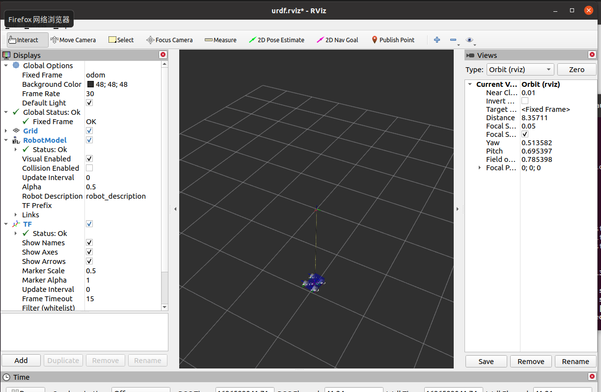

​		以上几张是普通小车在一级噪音下的路径截图，完全随机。

​        以下是加入PID控制之后的：

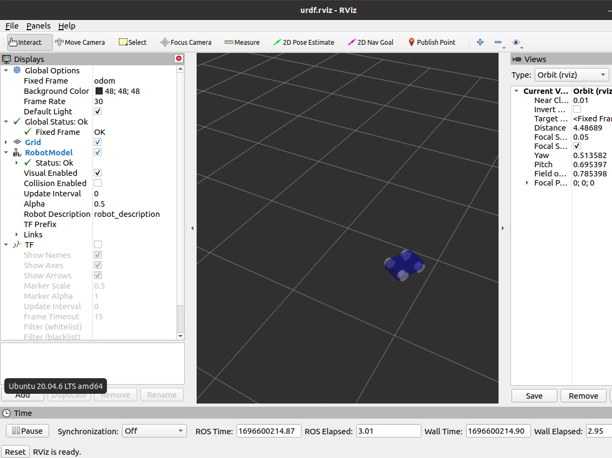

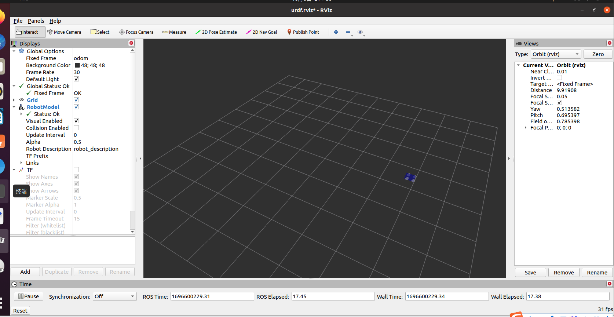

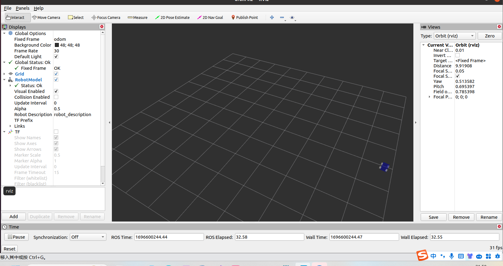

​		因为临时做完，不会显示路径，只能截图看（可以参考下方的ROS Time时间）。在运动过程中，小车身体抖动，但仍然可以走S弯。证明PID控制有效。

## 7- 总结

​		由于国庆过于放纵，所以没有充分学习（以上是在周四和周五一天半时间完成的结果）。整体任务完成十分仓促，有些地方可能展示不够全面，望见谅。