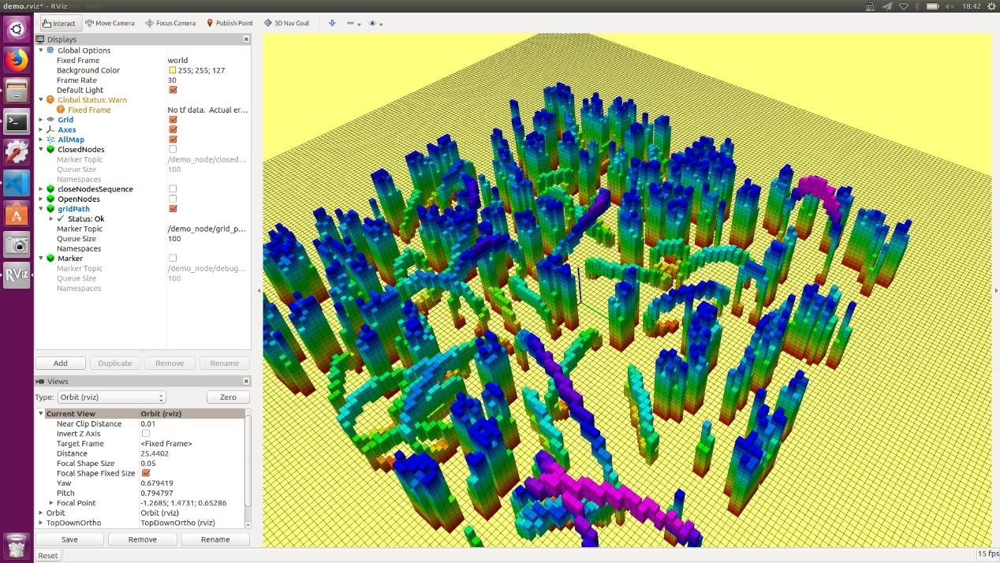

### Environment Setup

### 1.环境配置

#### 1.1 推荐系统

` Ubuntu 16.04`

`ROS Kinetic`

**Tips**

其它的版本的Ubuntu和ROS我也没有进行过测试，可能编译可能会碰到问题，需要自己尝试解决

#### 1.2 创建工作空间

>   Ctrl+alt+t，打开终端，复制并逐条运行以下命令

```shell
mkdir -p catkin_ws/src
cd catkin_ws/src
```

>   之后将我们提供的ros_workspace/src 中的三个文件夹复制到catkin_ws/src路径下

#### 1.3 编译代码

```shell
cd catkin_ws/
catkin_make
```

#### 1.4 运行

```shell
roslaunch grid_path_search demo.launch
```

#### 1.5 运行成功可看见如下效果


