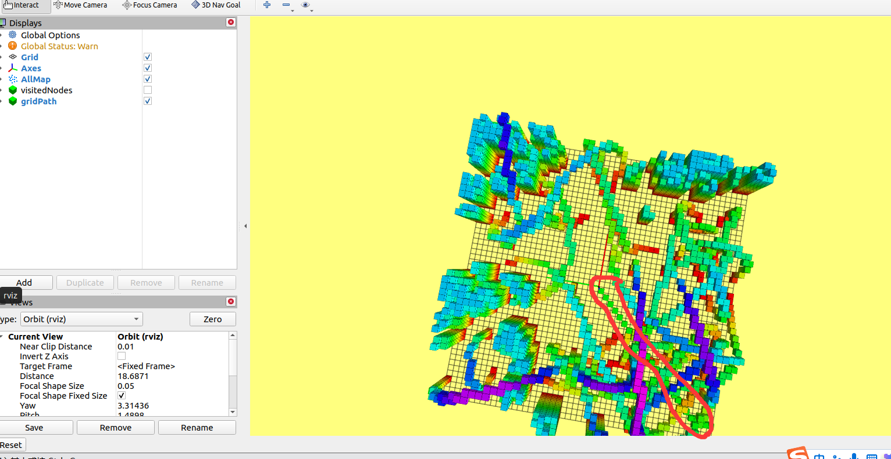
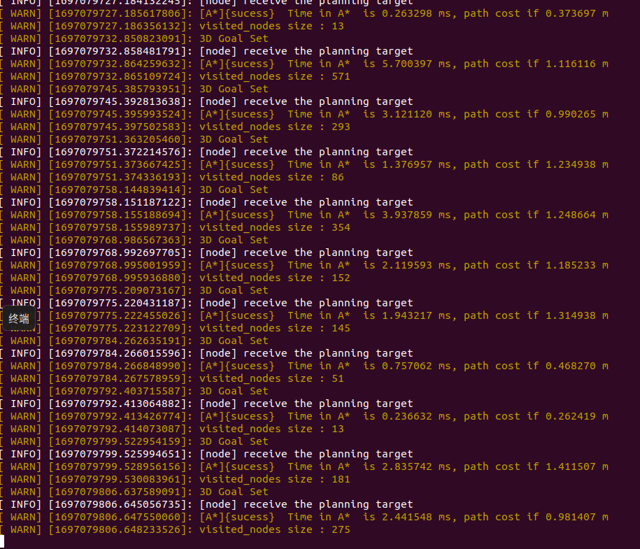

# 第三周任务报告

## 1- 环境配置

​		在一开始运行launch时，出错，不显示云地图，经查找，发现是demo.rviz里面的fixed frame有问题（应该是我的ubuntu版本的问题）将其从“world”改为“//world” 后正常显示云地图（任务里面“怎么运行所提供程序”模块中所提供的最后一条指令功能包的名字有误）：


## 2- 实现A*算法

​		经过学习，已经完成A*算法，具体代码在功能包中。下面对每个步骤进行说明：

​		第一步：计算H值。这里因为要对比三种路径方法的优劣，所以采用了if语句将三种路径都包含了进去。

​		第二步：主要是将开始节点放在Open  List里面，然后预留一个参数方便后面的当前节点放入Closed List中（这个参数没啥必要）。

​		第三步：取出openlist里面最小的f值的节点放入到closedlist中的操作。（closedlist其实并不真正存在，通过父节点和标志位去表示进入还有返回路径）

​		第四步：写寻找邻居节点的函数，并将其以及路径代价存入对应的vector中。主要思路是对各个方向的节点进行各种判断（障碍物？已经存在于closedlist？重复添加？等等）。

​		第五步：英文读起来很吃力，应该就是完成下面的对每个邻居的身份判定（在openlist，colsedlist还是两者都未加入）以及其对应下来的操作吧。

​		第六步：对于新发现的节点，更新它的F、G值和父节点之后加入openlist。

​		第七步：对于已经位于openlist里面的节点，要判断经过当前节点是否G值更小。是，就更新它的F、G值和父节点。

​		第八步：通过当前已经找到的目标和comefrom去回溯得到路径。

实现效果如下（图片与文字不是匹配的，随意截取的）：





## 3- 对比不同启发式函数对A*运行效率的影响

​		采用Euclidean时：



​		采用Diagonal Heuristic时：


​		采用Manhattan时：


​		虽然每次的地图随机，但是经过多次实验仍可以发现：***曼哈顿启发函数最优，每次寻路需要经过的节点少，对角式启发算法稍劣，欧几里得路径是效率最低的并且远不如前面两个***。

## 4- 对比是否加入Tie Breaker对A*运行效率的影响

​		网上学习来的tie_break代码：

```c++
    if (tie_break){
        double p = 1.0 / 25.0;
        Heu = Heu * (1.0 + p);
    }
```

​		tie_break在网上有各种解释，各种思路。经过思考，我认为我所采用tie_break的原理是***给H更高的权值，F中H占比变大，这样更倾向于通过H而不是G去对路径做出选择***。这样可以有效减少搜索的格数。

上面的所有数据均是启用tie_break时的数据，下面是关闭tie_break时采用Euclidean的数据：


​		可以明显看出，对比之前采用tie_break时，不采用tie_break效率降低很多。

## 5- 完成JPS算法以及A*和JPS算法效率的分析（选做）

​		JPS算法对A*最大的改进就是减小了openlist的存储压力，只存储跳跃点，提高效率。JPS算法的实现代码在功能包中,要完成部分基本思路和Astar一样。下面是实现：


​		红色的为JPS路径，绿色的为A*路径。


​		这样看似乎jps完全不如A*。但是这可能是因为地形并不复杂的缘故，因为jps在每个节点处向各个方向进行全方位搜索，在障碍物不多的情况下，很容易一不小心搜遍全图。

​		但如果地形十分复杂，那么jps的优势将显现出来，因为地形复杂，所以每个节点的搜索量就会减少（很容易触碰到障碍物），并且由于jps仅仅对跳跃点进行存储，那么相对于A*将每个邻近节点存入openlist的操作，jps的存储耗时极大减少，内存占用也减少，因此可以提高效率。

​		总之，***在地形不复杂时，选用Astar更好，当面对复杂地形时，选用jps更好。***（以上只是我的推论，因为我拿不出实践去支撑jps更优，仅就当前的地图来看，Astar更优，但我觉得这只是因为jps花费了太多时间去遍历了更多没用节点，如果地形复杂，情况就会改变）

## 6- 总结

​	任务全部完成。不过感觉自己还是不行啊。遗憾的是没能吧JPS的复杂地图实现出来，看看和我想的一不一样。