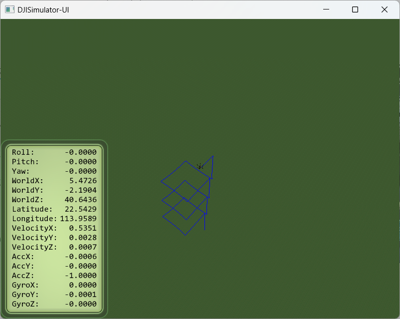

# 陈安康第四周代码任务报告

## 1.具体思路

​		target_offset_是相对于当前飞机的偏移量，想法是通过设置偏移量，通过状态切换实现围绕目标点飞行的目的，走过的形状是方形。

​		状态1：起飞到固定高度。

​		状态2：前进到目标点附近。

​		状态3：绕过目标点。

​		状态4：飞回起始点附近。

​		状态5：返回起始点。然后依据个人选择去执行语句（切换到状态2就是循环绕，或者停止，***本例是切换到状态1，即再往上飞一段继续重复2,3,4,5***。）

## 2.实现代码

​		主要是对demo_flight_control.cpp中的step()函数和gps_callback()函数进行修改。

​		 step函数如下，实现发布速度与控制飞行的目的：

```c++
static int stable_flag = 0;
  geometry_msgs::Vector3   localOffset;
  //float sample_time_interval = 0.1;

  float speedFactor         = 2;
  float yawThresholdInDeg   = 2;

  double xOffsetRemaining_past;
  double yOffsetRemaining_past;
  double zOffsetRemaining_past;

  float xCmd, yCmd, zCmd;//  ٶ     
  float yawDesiredRad = 0;
//坐标转换，将Gps转换为当地坐标偏移
  localOffsetFromGpsOffset(localOffset, current_gps, start_gps_location);

  double xOffsetRemaining = target_offset_x - localOffset.x;
  double yOffsetRemaining = target_offset_y - localOffset.y;
  double zOffsetRemaining = target_offset_z - localOffset.z;

static int index_t = 0;
index_t++;
//数据显示到界面上，方便排错
if(index_t==10){
  ROS_INFO("state:%d",state);
  ROS_INFO("xoffSET:%f",xOffsetRemaining);
  ROS_INFO("yoffSET:%f",yOffsetRemaining);
  ROS_INFO("zoffSET:%f",zOffsetRemaining);
  index_t=0;
}
//判断到达目标的模块，如果接近目标，计数器自增，到达阈值后终止该状态
if(abs(yOffsetRemaining)<1&&abs(xOffsetRemaining)<1&&abs(zOffsetRemaining)<1)
{
	inbound_counter++;
}
if(inbound_counter>=50)
{
     finished=true;
	sensor_msgs::Joy controlVel;
  uint8_t flag = (DJISDK::VERTICAL_VELOCITY  |
                    DJISDK::HORIZONTAL_VELOCITY |
                    DJISDK::YAW_RATE            |
                    DJISDK::HORIZONTAL_BODY   |
                    DJISDK::STABLE_ENABLE);

  controlVel.axes.push_back(0); // y vel
  controlVel.axes.push_back(0); //x vel
  controlVel.axes.push_back(0);
  controlVel.axes.push_back(0);
  controlVel.axes.push_back(flag);
  ctrl_generic_Pub.publish(controlVel);
	return ;
}
//控制速度，正常情况下保持0.5的匀速，如果距离目标偏移过近，就把速度设低，从而实现平稳到达目标处的目的
if(target_offset_x!=0){
  xCmd =xOffsetRemaining ;//+ kd_position*(xOffsetRemaining-xOffsetRemaining_past)/sample_time_interval;
  
  if(abs(xCmd)>=0.5)
  {
    if(xCmd>0) 
    {
      xCmd = 0.5;
    }
    else
    {
     xCmd = -0.5;
    }
  }
}
else xCmd=0;
if(target_offset_y!=0){
  yCmd =yOffsetRemaining ;//+ kd_position*(xOffsetRemaining-xOffsetRemaining_past)/sample_time_interval;
  
  if(abs(yCmd)>=0.5)
  {
    if(yCmd>0) 
    {
      yCmd = 0.5;
    }
    else
    {
     yCmd = -0.5;
    }
  }
}
else yCmd=0;
if(target_offset_z!=0){
zCmd = zOffsetRemaining ;//+ kd_position*(xOffsetRemaining-xOffsetRemaining_past)/sample_time_interval;
  
  if(abs(zCmd)>=0.5)
  {
    if(zCmd>0) 
    {
      zCmd = 0.5;
    }
    else
    {
     zCmd = -0.5;
    }
  }
}
else zCmd=0;
//发布速度通过ctrl_generic_Pub发布出去。
  sensor_msgs::Joy controlVel;
  uint8_t flag = (DJISDK::VERTICAL_VELOCITY  |
                    DJISDK::HORIZONTAL_VELOCITY |
                    DJISDK::YAW_RATE            |
                    DJISDK::HORIZONTAL_BODY   |
                    DJISDK::STABLE_ENABLE);

  controlVel.axes.push_back(yCmd); // y vel
  controlVel.axes.push_back(-xCmd); //x vel
  controlVel.axes.push_back(zCmd);
  controlVel.axes.push_back(0);
  controlVel.axes.push_back(flag);
  ctrl_generic_Pub.publish(controlVel);
  
  xOffsetRemaining_past = xOffsetRemaining;
  yOffsetRemaining_past = yOffsetRemaining;
  zOffsetRemaining_past = zOffsetRemaining;
  
 // if(state == 3)
//  {
   
 // }
```

​		该函数实现***控制速度，速度发布，判断是否达到目标偏移***的功能。通过ctrl_generic_Pub将速度发布出去。控制速度，正常情况下保持0.5的匀速，如果距离目标偏移过近，就把速度设低，从而实现平稳到达目标处的目的。通过设置inbound_counter来延迟判断终止条件，当距离目标偏移很近的区域内，inbound_counter自增，到达一定阈值后设置标志位，终止函数。

​		gps_callback函数内实现如下：

```c++
void gps_callback(const sensor_msgs::NavSatFix::ConstPtr& msg)
{
  static ros::Time start_time = ros::Time::now();
  static int start_flag = 0;
  ros::Duration elapsed_time = ros::Time::now() - start_time;
  current_gps = *msg;
  if(start_flag == 0){
    square_mission.start_gps_location = current_gps;
    start_flag = 1;
   }
  // Down sampled to 50Hz loop
  if(elapsed_time > ros::Duration(0.02))
  {
    //ROS_INFO("Elapsed time: %f; GPS: lat=%.3f, long=%.3f", elapsed_time.toSec(), msg->latitude, msg->longitude);
    start_time = ros::Time::now();
	switch(square_mission.state)
{
case 0:
break;
case 1:
if(!square_mission.finished){
square_mission.step();
}
else{
square_mission.reset();
square_mission.start_gps_location=current_gps;
//square_mission.start_local_position=current_local_pos;
square_mission.setTarget( 0, 10, 0, 0);
square_mission.state=2;
square_mission.finished=false;
}
break;

case 2:
if(!square_mission.finished){
square_mission.step();
}
else{
square_mission.reset();
square_mission.start_gps_location=current_gps;
//square_mission.start_local_position=current_local_pos;
square_mission.setTarget( 10, 0, 0, 0);
square_mission.state=3;
square_mission.finished=false;
}
break;

case 3:
if(!square_mission.finished){
square_mission.step();
}
else{
square_mission.reset();
square_mission.start_gps_location=current_gps;
//square_mission.start_local_position=current_local_pos;
square_mission.setTarget( 0, -10, 0, 0);
square_mission.state=4;
square_mission.finished=false;
}
break;

case 4:
if(!square_mission.finished){
square_mission.step();
}
else{
square_mission.reset();
square_mission.start_gps_location=current_gps;
//square_mission.start_local_position=current_local_pos;
square_mission.setTarget( -10, 0, 0, 0);
square_mission.state=5; 
square_mission.finished=false;
}
break;

case 5:
if(!square_mission.finished){
square_mission.step();
}
else{
square_mission.reset();
square_mission.start_gps_location=current_gps;
//square_mission.start_local_position=current_local_pos;
square_mission.setTarget(0,0,10,0);
square_mission.state=1;
square_mission.finished=false;
}
break;
}
  }
```

​		该函数是回调函数，收到gps位置信息后，通过状态转移和step函数调用去实现控制飞行路线的目的。通过switch去判断当下状态，并且重设参数，修正起止点，跳转状态，实现路线控制。

## 3.实现的成果

​		因为是状态5切换到状态1，所以他会向上再飞一段再方形绕圈。

​		

## 4.总结

​		感谢张博韬学长的帮助指导，不然代码我指定寄了。