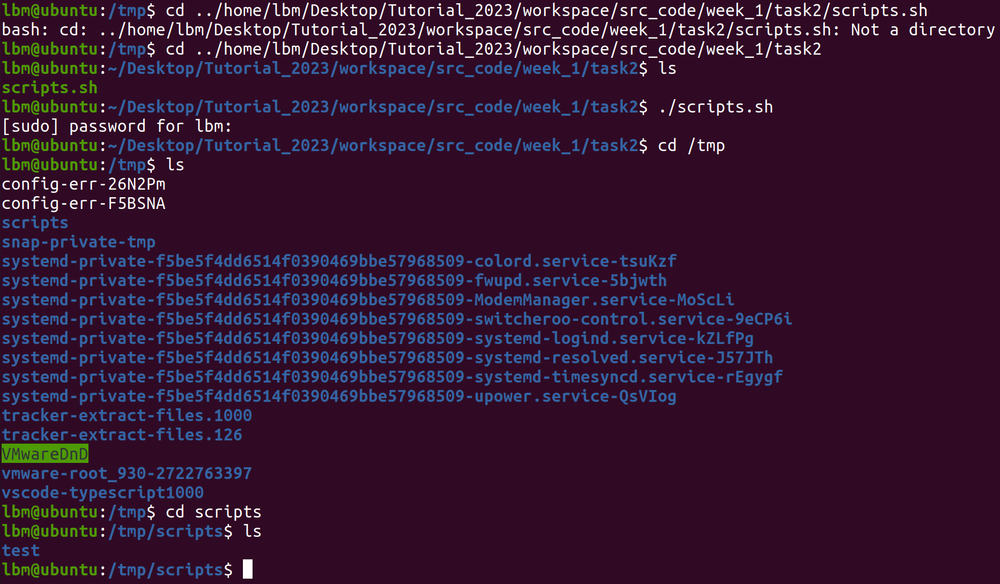

### 任务说明
#### 总述
+ ubuntu版本为Ubuntu 20.04.6 LTS
+ cmake版本为version 3.16.3

#### 任务一
+ 编辑器为vscode
+ 编译过程和输出结果如图
 

 #### 任务二
+ 脚本运行前要使用```useradd -m redhat```命令来创建用户```redhat```，否则脚本会报错
+ 脚本中操作根目录的```tmp```文件夹是用```sudo```来获取root权限，否则无法访问
+ 输出运行结果如下
     
     
     成功创建目录并复制

