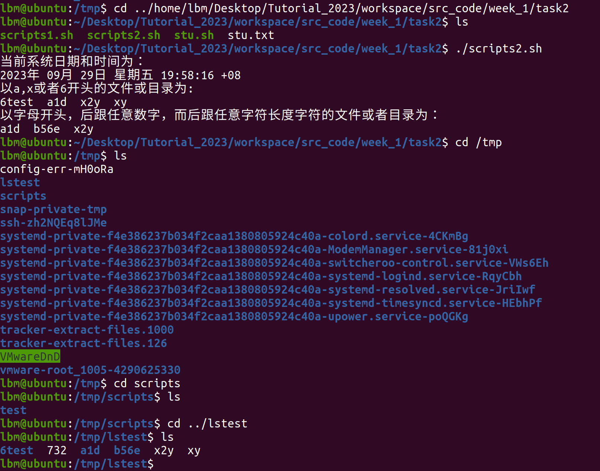
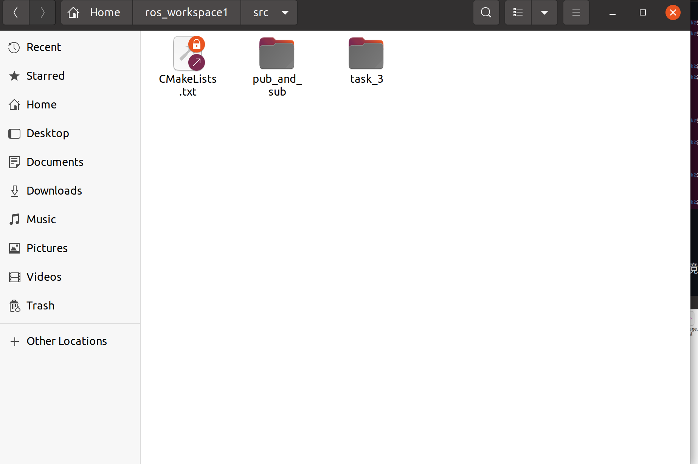
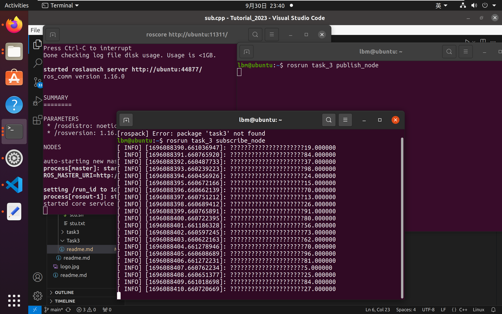

### 任务说明
#### 总述
+ ubuntu版本为Ubuntu 20.04.6 LTS
+ cmake版本为version 3.16.3
+ 编辑器为vscode

#### 任务一
+ 思路为遍历整个链表，然后将每个节点的指针指向前一个
+ 编译过程和输出结果如图
 

 #### 任务二
 ##### 脚本1
+ 脚本编辑好后要用```chmod +x xxx.sh```命令来使脚本具有执行权限
+ 脚本运行前要使用```useradd -m redhat```命令来创建用户```redhat```，否则脚本会报错
+ ```chmod```、```cp```和```chown```命令需要用```sudo```来授予```root```权限
+ 运行过程及输出结果如下


成功创建目录并复制

##### 脚本2
+ 脚本编辑好后要用```chmod +x xxx.sh```命令来使脚本具有执行权限
+ 运行过程及输出结果如下


脚本成功执行
>*疑问：```ls```命令后面的正则表达式```[]```而不加```*```无法匹配，如```[a-z]```无法匹配字母```a-z```，而```[a-z]*```可以*
  
##### 脚本3
+ 思路为每个功能定义一个函数，然后用```if```和```case```来判断输入参数，然后转到相应功能
+ 脚本编辑好后要用```chmod +x xxx.sh```命令来使脚本具有执行权限
+ 运行结果如图


#### 任务三
+ 按照教程创建工作空间和设置环境变量，然后创建功能包，结果如下

+ 在src中编写```pub.cpp```文件作为发布节点源码，编写```sub.cpp```文件作为订阅节点源码
+ 按照教程修改```CMakeLists.txt```文件来编译源码，同时修改```package.xml```文件
+ 最终运行结果如图
  

#### 所有任务完成