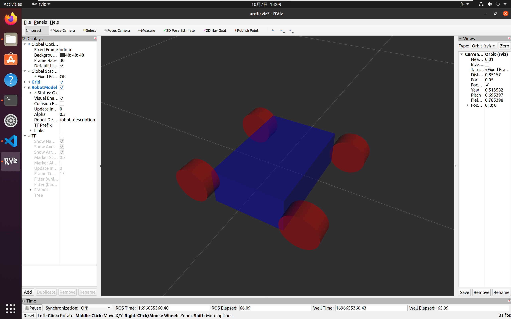

### 第二周任务说明
#### 任务一
+ 思路：用```srand()```函数设置随机数种子，再用```rand()```来获得随机数，最后再通过自定义的服务数据实现客户端和服务端的通讯
+ 执行过程和输出结果如图

>*待解决：中文在终端中无法正常输出*
+ 通过```.launch```文件启动的结果如下


*截至2023.10.6*仅完成任务1，同时udrf模型文件，但仍存在问题

#### 任务二
+ 完成了小车urdf模型的搭建，如图所示

>*源码中的launch文件有误，耗了很多时间*