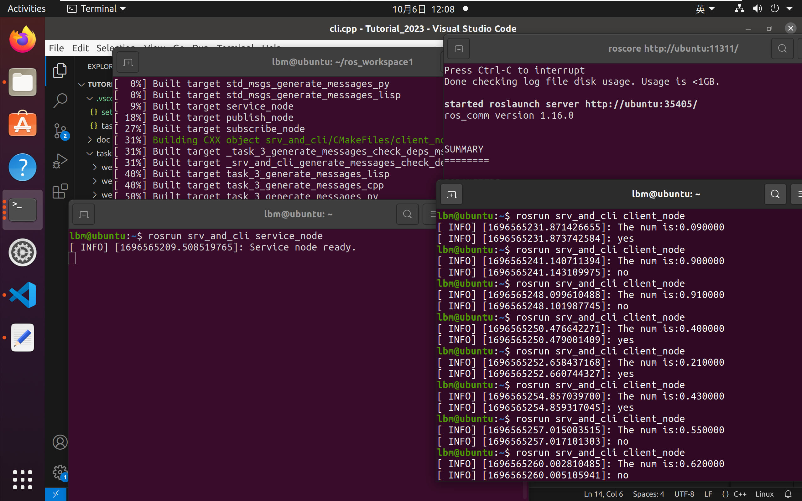
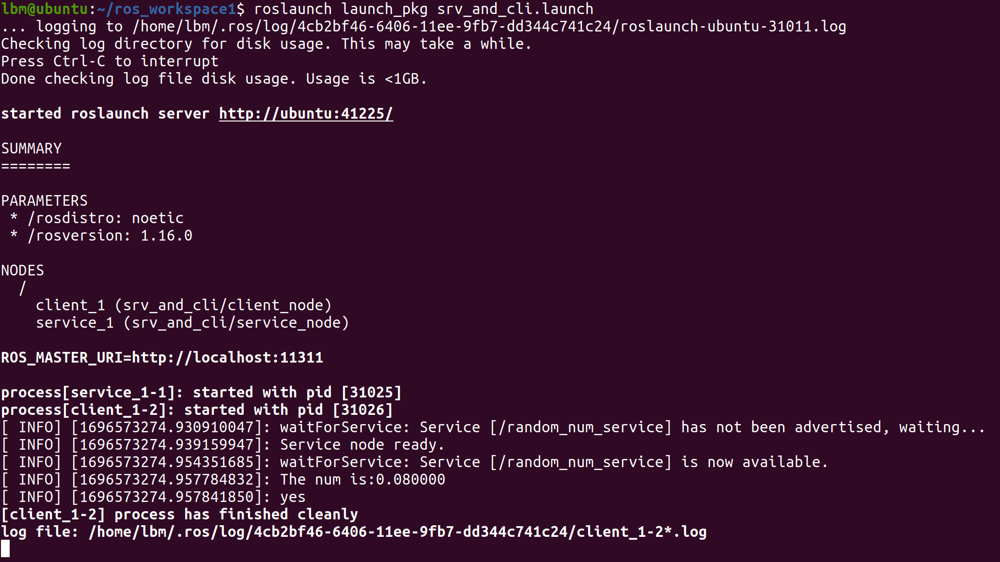
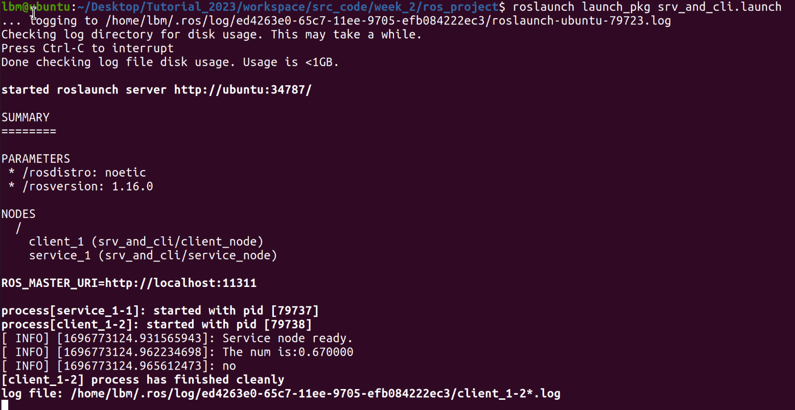
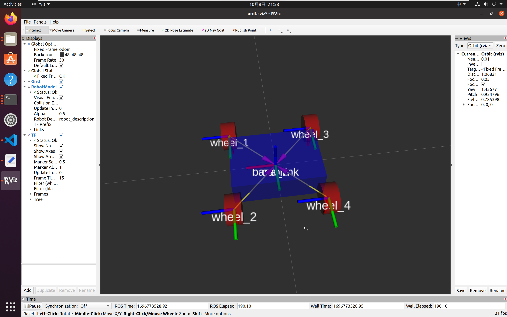

### 第二周任务说明
#### 任务一
+ 思路：用```srand()```函数设置随机数种子，再用```rand()```来获得随机数，最后再通过自定义的服务数据实现客户端和服务端的通讯
+ 执行过程和输出结果如图

>*待解决：中文在终端中无法正常输出*
+ 通过```.launch```文件启动的结果如下


*截至2023.10.6*仅完成任务1，同时udrf模型文件，但仍存在问题

#### 任务二
+ 完成了小车urdf模型的搭建，如图所示

>*源码中的launch文件有误，耗了很多时间*

~~*截至2023.10.6*仅完成任务1，同时补充了udrf模型文件，但仍存在问题~~
#### 更新
+ 第二周任务源码均在```ros_project```下
+ 完成了```service```和```client```的编写，并能够用```.launch```文件来启动，可以通过```roslaunch launch_pkg srv_and_cli.launch```来启动,效果如下

+ 完成了小车模型的补充，可以通过```roslaunch launch/little_car.launch```命令来查看，效果如图

+ 完成了publisher控制小车转弯，可以在无噪声的情况下走s弯，可以通过```roslaunch launch/launch_turn_s.launch```命令来查看效果
+ 完成了在有噪声的情况下小车转s弯，但pid参数没有调好，故效果不佳，可以通过```roslaunch launch/launch_show_noise.launch```来查看小车没有进行pid控制时在有噪声情况下的行驶效果，同时可以通过```roslaunch launch/launch_turn_s_noise.launch```来查看经过pid控制后小车的行驶效果
+ pid控制代码在```workspace/src_code/week_2/ros_project/src/car_turn/src```中
