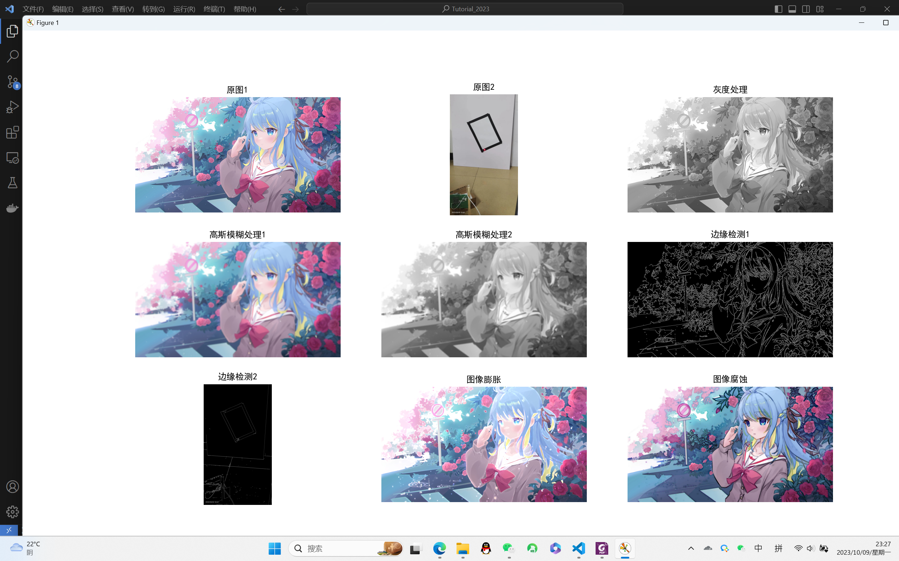
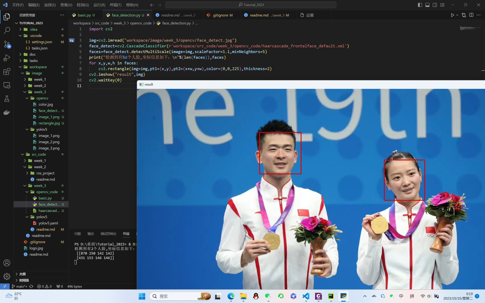
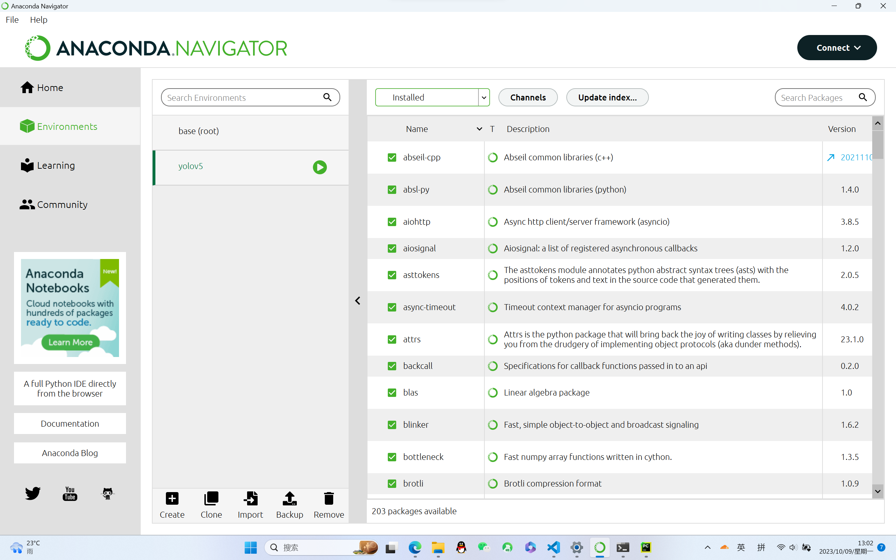
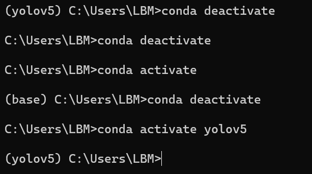
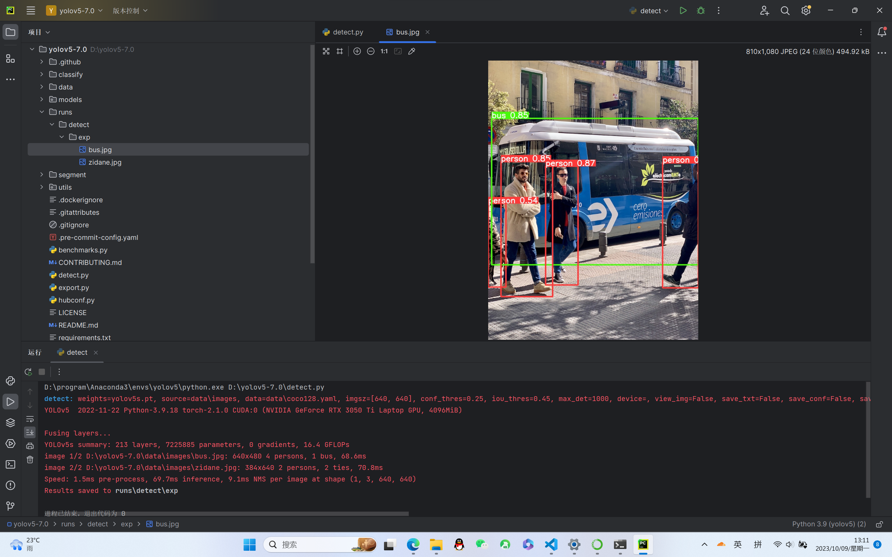

### 第三周任务说明
#### opencv学习任务
+ opencv基础操作源码为```basic.py```，解释器为3.11.6
+ 如果用opencv自带的函数来实现单个窗口显示多张图片，直接合并时如果尺寸不同或者颜色通道不同时，会出现黑屏，实现起来比较麻烦，，所以要借助```matplotlib```模块来实现
+ 灰度化即图像每个像素只有一个灰度值，没有颜色信息
+ 高斯模糊就是对整幅图像进行加权平均，一般对灰度图像进行处理
+ 边缘检测的一般步骤为滤波、增强、检测，基本思想是利用边缘增强算子突出图像局部边缘，通过设置阈值的方法提取边缘点集，其实就是对图像进行求导，比较有名的算法为Canny算法，也可以通过```Laplacian```算子，```Sobel```算子和```Scharr```算子进行处理
+ 膨胀和腐蚀：膨胀就是对图像高亮部分进行扩张，腐蚀就是对图像高亮部分进行缩小，膨胀可以用来处理缺陷问题，腐蚀可以用来处理毛刺问题
+ 最后的输出效果为

+ 人脸检测源码为```face_detect```
+ 通过opencv自带的级联分类器来实现，并且在opencv包中找到```haarcascade_frontalface_default.xml```文件来作为人脸识别的Haar特征
+ 最终实现的效果如下图所示

#### 环境部署任务
+ 成功在windows系统下配置了python和Anaconda环境，如图下图所示


+ 成功部署了```YOLOv5```模型，所部署的发布版本为```v7.0```，并成功运行```detect.py```，如下图所示

+ 所部署的```yolov5```环境配置文件```yolov5.yaml```在```workspace\src_code\week_3\yolov5```文件夹中