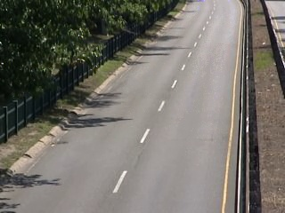
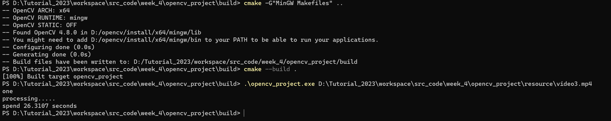

### 第四周任务说明
+ 在windows系统上完成
+ 由于要使用vscode来管理项目，所以参考了网上的教程将opencv的源码重新编译，然后使其能够适用于mingw编译器
+ 考虑兼容性，把opencv的源码放在了工程目录的```lib```文件夹下
+ 实现了能够还原图像的基本任务
+ 不足：算法不够巧妙，处理速度十分慢
+ 算法概述：首先将视频流按帧分割成多个图像，将图像的像素BGR分别存在二维向量中，第一维度是第几个图像，第二维度是像素值，然后按顺序将所有的图像的某个像素读取到向量中，然后使用c++STL库找出该向量中出现次数最多的值，把他看作是背景的像素值，最后再合并到一个向量中，然后根据BGR三个通道重组图像，即可获得背景。
+ 对于三个视频的处理效果：对于视频1,由于视频最后前景在某一位置在某一位置停留时间较久，在那个位置处理效果不是很好；对于视频二，可能由于文件较大的原因，该程序无法处理，但没有报错，目前没有找到原因；对于视频三，由于时间较长，并且车流流动明显，处理效果显著
+ 其中两个视频处理效果如下


+ 过程如下

+ [程序下载地址](https://wwvg.lanzouj.com/i9Mkr1c2gr9i)
