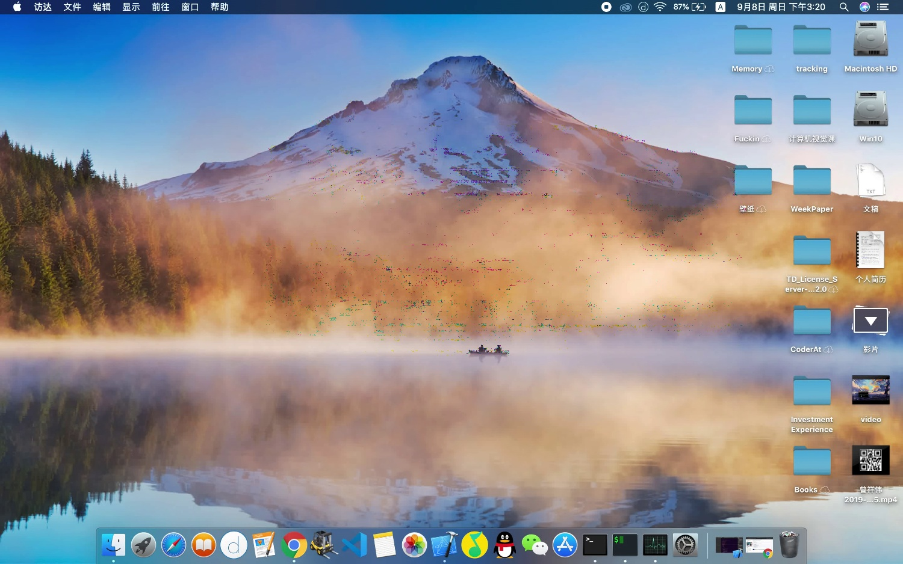
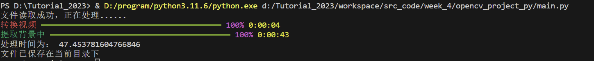
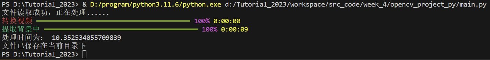
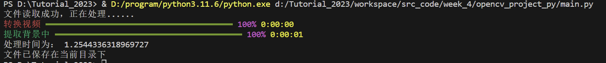
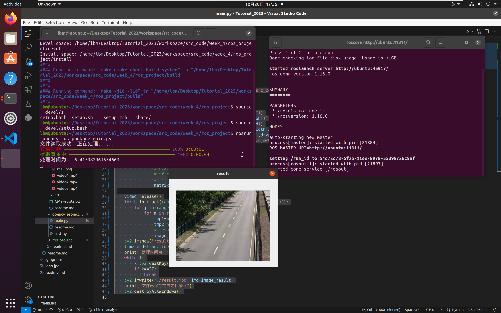

### 第四周任务说明
+ 在windows系统上完成
+ 由于要使用vscode来管理项目，所以参考了网上的教程将opencv的源码重新编译，然后使其能够适用于mingw编译器
+ 考虑兼容性，把opencv的源码放在了工程目录的```lib```文件夹下
+ 实现了能够还原图像的基本任务
+ 不足：算法不够巧妙，处理速度十分慢
+ 算法概述：首先将视频流按帧分割成多个图像，将图像的像素BGR分别存在二维向量中，第一维度是第几个图像，第二维度是像素值，然后按顺序将所有的图像的某个像素读取到向量中，然后使用c++STL设计算法找出该向量中出现次数最多的值，把他看作是背景的像素值，最后再合并到一个向量中，然后根据BGR三个通道重组图像，即可获得背景。
+ 对于三个视频的处理效果：对于视频1,由于视频最后前景在某一位置停留时间较久，所以在那个位置处理效果不是很好；对于视频二，可能由于文件较大的原因，该程序无法处理，但没有报错，目前没有找到原因；对于视频三，由于时间较长，并且车流流动明显，处理效果显著
+ 其中两个视频处理效果如下


+ 过程如下

+ [程序下载地址](https://wwvg.lanzouj.com/i9Mkr1c2gr9i)

#### *更新*
通过判断，对过大的图像进行压缩，可以成功处理视频二，效果如下


#### *更新二*
+ 使用python重写了代码，前面写的c++源码耗费时间巨大可能原因是向量的不断增加长度导致耗时较长，也就是```push_back```函数，它要不断查询内存空间是否够用，不够再开辟新的内存空间，可能改成提前获得所需长度，一次性申请足够内存空间可以大大缩小时间。
+ 使用python编写比c++更加便捷，不用考虑数据类型和内存，且有强大的```numpy```库来对数据进行处理
+ 该算法可能不太适用于视频流的处理，因为需要获取视频所有帧数来一起处理，但也许对于视频流也可以截取一段合理的时间来算出背景
+ 运行过程如下，结果与c++程序相同




#### *更新三*
+ 实现为ros的功能包，运行过程和结果如下
