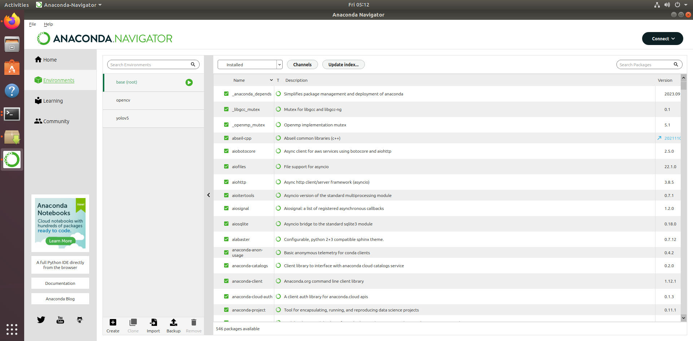

# 第三周视觉组报告
## anaconda管理
进入[官网](https://www.anaconda.com/download/)下载linux版的文件
之后到下载的地址用bash 启动对应的sh文件
之后就下一步下一步的操作，这里记得写入环境变量
在bash中输入anaconda-navigator进入图形化界面
如图：

这里面我已经建立了opencv和yolov5的环境
相应的考核都是在对应环境下完成的，上传的文件只是将源文件移过来了，是不能直接运行的
## 基础操作
opencv的图像处理是基于数字图像处理的，它首先把图片处理成为矩阵，矩阵的每个元素代表图像中的一个像素，之后就会有各种算法进行处理
### 灰度化
灰度化的原理是
GRAY = 0.3 * R + 0.59 * G + 0.11 * B
这个公式把红黄蓝三种颜色转换成为对应的灰度
opencv将图像处理成为矩阵后，对每个元素都运用这个公式处理
得到的新矩阵就是灰度化了的图像
源代码在test1里，
效果如下：

### 高斯模糊
高斯模糊是将图像模糊平滑的，通常用来减少图像噪声，降低细节
原理是让一个像素点的输出值 = 这个像素点与周围像素点的加权和
之所以叫高斯模糊是因为取的权重是符合高斯函数的
在我们使用当中只需将周围像素点的范围确定，标准差确定就可以了
源代码在test2里，
效果如下：

### 边缘检测
原理是当图片内容发生变化时，例如从白色的背景变到oled上时，像素的灰度会发生突变，图像灰度的导数就会有相应的变化，这样就描述了图像的边缘
我们传入的参数分别是处理的图片，阈值，算子
源代码在test3里，
效果如下：

### 膨胀
原理是选定一个卷积核，让卷积核沿图移动，让卷积核范围里最大值取代中心位置像素的值
源代码在test4里，
效果如下：

### 腐蚀
原理是选定一个卷积核，让卷积核沿图移动，只有所有元素都为1时，中心元素才为1，否则为0
源代码在test5里,
其中我是在膨胀的基础上实现腐蚀的
图片从左到右分别是原图，膨胀，腐蚀
效果如下

## yolov5
### 第一步
新建一个环境，进入环境
git clone 下来yolov5
```
$git clone https://github.com/ultralytics/yolov5.git
```
### 第二步
下载权重文件
在[yolov5下的tag中的5.0版本](https://github.com/ultralytics/yolov5/releases/tag/v5.0)下的assets中选择相应的权重文件下载
放入之前clone下来的文件夹里
### 第三步
在detect.py文件里加入自己选择的图片
运行
效果如下：
