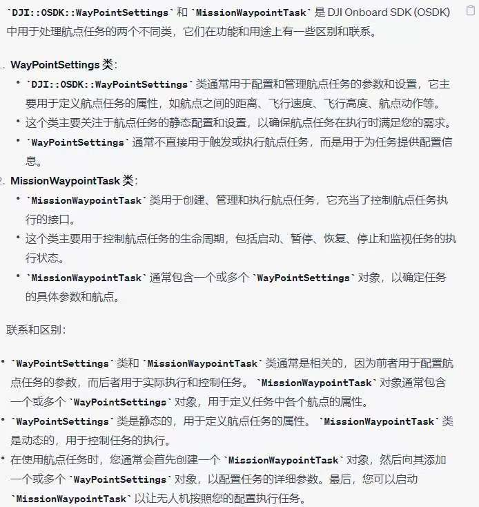

#第四周任务
##想法：
1.将flight_control里四段路程的数据修改至能绕两点做矩形运动
2.可以将mission里面绕六个航点做正六边型任务数据修改成正四边形
##截图

##flight_control解读
1.mission 类里的相关成员

    int state;//标记任务执行的状态
    int inbound_counter;//如果现在位置在目标点的周围的一定范围内，inbound_counter累加
    int outbound_counter;//如果不在范围内会累加，加到一定程度，会重设inbound和outbound重新来
    int break_counter;//当inbound_counter累加到一定的时候，说明稳定在目标点周围了，会增加break_counter进一步靠近，当break_counter增加到一定大小会认为无人机已经到达一个目标点，可以结束了
    float target_offset_x;
    float target_offset_y;
    float target_offset_z;
    float target_yaw;//关于目标点的相关信息
    sensor_msgs::NavSatFix start_gps_location;
    geometry_msgs::Point start_local_position;//起始点的相关信息
  2.mission类里的成员函数

    void localOffsetFromGpsOffset(geometry_msgs::Vector3&  deltaNed ,sensor_msgs::NavSatFix& target,sensor_msgs::NavSatFix& origin);//将target相对于origin的坐标存在deltened里面
    void gps_callback(const sensor_msgs::NavSatFix::ConstPtr& msg);//在flight_control里在这个函数里完成整体控制，根据state的不同，重新制定target
    bool takeoff_land(int task);//只能理解一点点，DroneTaskControl里面的task代表不同的行动，如4是起飞，6是降落，result代表结果
    bool obtain_control();//取得控制权

  3.源文件

     ros::Subscriber attitudeSub = nh.subscribe("dji_sdk/attitude", 10, &attitude_callback);//姿态角订阅
     ros::Subscriber gpsSub      = nh.subscribe("dji_sdk/gps_position", 10, &gps_callback);//Gps订阅
     ros::Subscriber localPosition = nh.subscribe("dji_sdk/local_position", 10, &local_position_callback);//惯性坐标
     ros::Subscriber flightStatusSub = nh.subscribe("dji_sdk/flight_status", 10, &flight_status_callback);//飞行状态

     ctrlPosYawPub = nh.advertise<sensor_msgs::Joy>("dji_sdk/flight_control_setpoint_ENUposition_yaw", 10);//发布目标位置和偏航角
     ctrlBrakePub = nh.advertise<sensor_msgs::Joy>("dji_sdk/flight_control_setpoint_generic", 10);//发布控制指令

     /*服务的客户端*/
     sdk_ctrl_authority_service = nh.serviceClient<dji_sdk::SDKControlAuthority> ("dji_sdk/sdk_control_authority");//请求控制权限
     drone_task_service         = nh.serviceClient<dji_sdk::DroneTaskControl>("dji_sdk/drone_task_control");//请求起飞，返航，着陆
     set_local_pos_reference    = nh.serviceClient<dji_sdk::SetLocalPosRef> ("dji_sdk/set_local_pos_ref");//设置惯性参考系
    

    (1)先获得控制起飞，并且初始化mission
    
    
(2):在gps_callback里开启任务，调整任务
    
    
（3）具体如何靠近目标，在step()里面
    
 然后就是根据inbound_counter和outbound_counter还有break_counter的条件判断进行控制，发布控制指令

##flight_mission解读
1.源文件
 （1）

    waypoint_upload_service = nh.serviceClient<dji_sdk::MissionWpUpload>(
    "dji_sdk/mission_waypoint_upload");//发布更新一个新的航点任务

    
    waypoint_action_service = nh.serviceClient<dji_sdk::MissionWpAction>(
    "dji_sdk/mission_waypoint_action");//航点任务的控制

这个没怎么懂

 （2）
   
    bool runWaypointMission(uint8_t numWaypoints, int responseTimeout)
首先
dji_sdk::MissionWaypointTask类定义

    setWaypointDefaults(WayPointSettings* wp)//初始化waypointTask

然后创造航点

    std::vector<DJI::OSDK::WayPointSettings> createWaypoints(int numWaypoints, float64_t distanceIncrement,
                float32_t start_alt)
    std::vector<DJI::OSDK::WayPointSettings> generateWaypointsPolygon(WayPointSettings* start_data, float64_t increment,
                         int num_wp)
WayPointSettings

设置起点，根据要执行的任务，生成航点集，具体看注释

再更新Task,但是不是很明白，为什么不直接在task里面设置point，而要弄一个WayPointSettings的vector，在根据里面的信息设置point

最后运行

