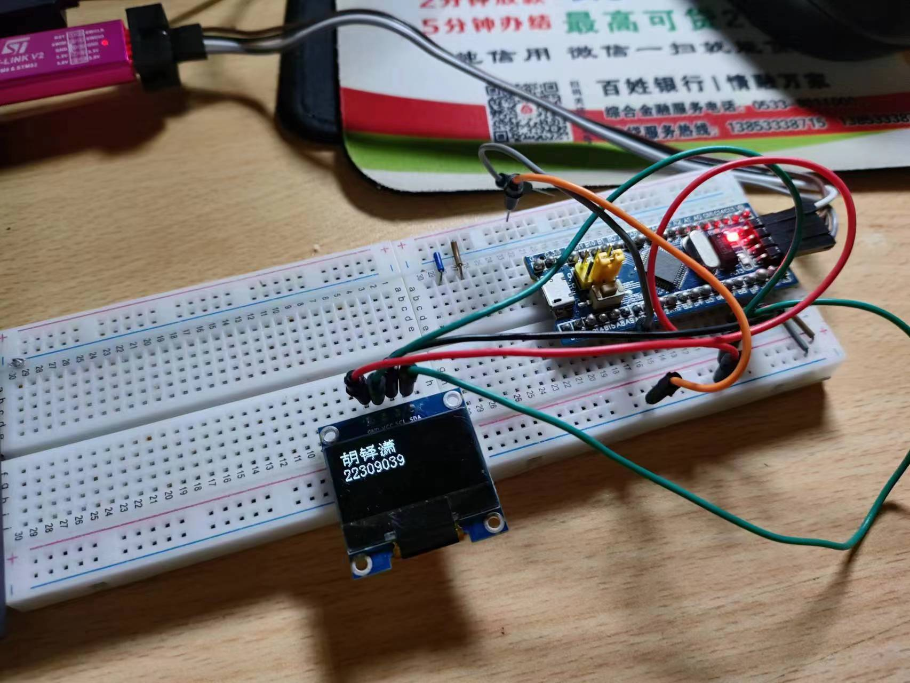

## 基础考核第一周完成情况提交

- **作者**：胡铎潇
- **日期**：2023-10.7
- **版本**：1.0.0
- **摘要**：1.初步了解stm32

------
#### 1. 视频
##### 1.1 7个LED，每个LED交替亮，每个LED亮的时间为500ms

##### 1.2 按键实现LED的开关，按一下LED亮，再按一下LED灭

##### 1.3 实现电位器调节LED的亮度

##### 1.4 0.96寸OLED的驱动，显示姓名学号

