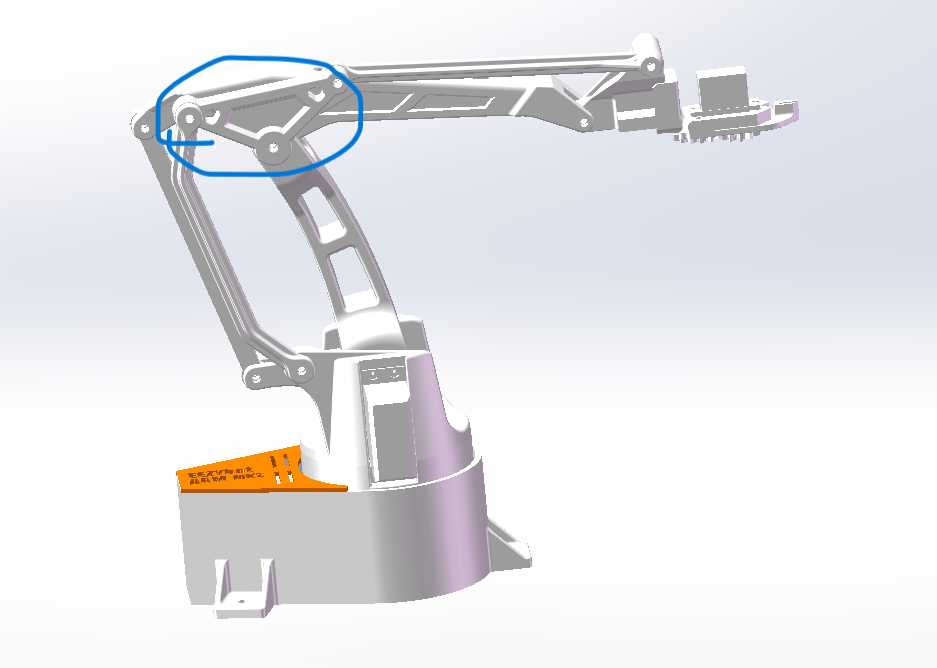

## 基础考核第二周完成情况提交

- **作者**：胡铎潇
- **日期**：2023-10-6
- **版本**：1.0.0
- **摘要**：各个机械结构功能以及solidworks绘制零件

------

#### 1. 机械结构的功能

* 1(1.10.11.12.13.)基座，承载机械臂的结构，控制左右旋转。
* 2(2.)控制机械臂前后探头运动的支撑臂。
* 3(3.4.5.6.7.)控制机械臂的后臂围绕如图所示轴转动。

* 4(14.15.16.17.18.)控制夹取物品。

#### 2.零件完成情况
* 已完成14个零件的复现，未完成的如图标注

